# Code structure

Guide for navigating the rBuilder workspace: how crates are segmented, how they connect, and where to put new functionality so it is not duplicated elsewhere.

---

## 1. Crate segmentation (overview)

```mermaid
flowchart TB
    subgraph entry["Entry & CLI"]
        RB["rbuilder<br/>(binary + src/cli)"]
    end

    subgraph facade["Facade"]
        CORE["rbuilder-core<br/>re-exports workspace API"]
    end

    subgraph orchestration["Orchestration"]
        PIPE["rbuilder-pipeline<br/>discover / index repo"]
        INC["rbuilder-incremental<br/>file tracker, deltas"]
    end

    subgraph extraction_layer["Extraction"]
        EXT["rbuilder-extraction<br/>discover files, build graph"]
    end

    subgraph plugins["Plugin system"]
        API["rbuilder-plugin-api<br/>LanguagePlugin trait"]
        HELP["rbuilder-plugin-helpers<br/>tree-sitter helpers"]
        RUNTIME["rbuilder-lang-runtime<br/>generic TS/regex plugins"]
        CFG["rbuilder-config-formats<br/>yaml/json/toml/properties"]
        REG["rbuilder-registry<br/>LanguageRegistry"]
        LANGS["rbuilder-languages<br/>all Tier 1 plugins"]
        LANG["rbuilder-lang-*<br/>(language implementations)"]
    end

    subgraph storage["Graph storage"]
        GRAPH["rbuilder-graph<br/>CodeGraph, schema, snapshots"]
    end

    subgraph analytics["Graph analytics"]
        ANALYSIS["rbuilder-analysis<br/>blast-radius, CFG/PDG, taint, …"]
    end

    subgraph query_export["Query & output"]
        GQL["rbuilder-gql<br/>Cypher-like graph queries"]
        EXPORT["rbuilder-export<br/>HTML, Mermaid, GraphML, DOT"]
    end

    subgraph cross_cutting["Cross-cutting"]
        SEM["rbuilder-semantic<br/>signatures, IDL, types"]
        RULES["rbuilder-rules<br/>labeling rule engine"]
        SEC["rbuilder-security<br/>CVE / vulnerability patterns"]
        PROJ["rbuilder-project-config<br/>.rbuilder config, secrets, drift"]
        ERR["rbuilder-error<br/>shared Error type"]
        MACROS["rbuilder-macros<br/>plugin derive macros"]
    end

    RB --> CORE
    RB --> PIPE
    RB --> ANALYSIS
    RB --> GQL
    RB --> EXPORT

    CORE --> GRAPH
    CORE --> ANALYSIS
    CORE --> PIPE
    CORE --> EXT
    CORE --> GQL
    CORE --> EXPORT
    CORE --> INC
    CORE --> REG
    CORE --> SEM
    CORE --> RULES
    CORE --> SEC
    CORE --> PROJ

    PIPE --> EXT
    PIPE --> GRAPH
    PIPE --> REG

    EXT --> GRAPH
    EXT --> API

    REG --> API
    REG --> CFG
    LANGS --> REG
    LANGS --> LANG
    LANG --> API
    LANG --> HELP
    LANG --> RUNTIME

    ANALYSIS --> GRAPH
    ANALYSIS --> ERR

    GQL --> GRAPH
    GQL --> ANALYSIS

    EXPORT --> GRAPH

    INC --> GRAPH

    SEM --> API
    RULES --> GRAPH
    SEC --> GRAPH
    PROJ --> EXT

    GRAPH --> ERR
    PIPE --> ERR
    EXT --> ERR
    GQL --> ERR

    MACROS -.-> LANG
```

**Reading the diagram:** Data generally flows **down and left-to-right** during `discover`: registry → extraction → graph → analysis → persisted `.rbuilder/` artifacts. Query commands (`blast-radius`, `gql`, `inspect`) read the graph and analysis layers without re-parsing source unless slicing or CFG is required.

---

## 2. Segmented design (details)

### Design principles

| Principle | What it means in practice |
|---|---|
| **One graph model** | All nodes/edges live in `rbuilder-graph`. Do not invent a parallel graph type in CLI or analysis code. |
| **Plugins extract, pipeline orchestrates** | Language-specific parsing stays in `rbuilder-lang-*` (via `LanguagePlugin`). File walking and graph assembly stay in `rbuilder-extraction` / `rbuilder-pipeline`. |
| **Analysis is graph-only** | Algorithms in `rbuilder-analysis` take `MemoryBackend`, `PetGraphView`, or snapshots — not raw source files (except CFG/PDG/slice paths that explicitly need source). |
| **CLI is thin** | `src/cli/` parses args, resolves paths, calls library crates. Heavy logic belongs in workspace crates, not new `src/cli/*.rs` helpers. JSON shape lives in `*_output.rs`; graph/cache enrichment stays in `rbuilder-analysis`. |
| **Errors are centralized** | Use `rbuilder_error::Error` / `Result` from `rbuilder-error`. Do not add ad-hoc error enums in the CLI. |
| **All languages always linked** | The binary always includes all nine Tier 1 language plugins via `rbuilder-languages`. |

### Layer responsibilities

#### Entry (`rbuilder` root crate)

- **`src/main.rs`** — process entry, dispatches to CLI.
- **`src/cli/`** — subcommands: `discover`, `blast-radius`, `serve`, `gql`, `slice`, `inspect`, `metrics`, `semantic`, `communities`, `cpg`, `check`, `export`.
- **`src/cli/http_serve.rs`** — default `serve`: dashboard + `POST /api/query`.
- **`src/cli/query_daemon.rs`** — `serve --daemon`; optional blast-radius client when `.rbuilder/query.sock` exists (`RBUILDER_NO_QUERY_DAEMON=1` to disable).
- **`src/cli/*_output.rs`** — typed JSON serializers (`blast_radius_output`, `discover_output`, `gql_output`, …). Commands assemble domain results from workspace crates and serialize here; **do not** embed algorithm logic in output modules.
- **`src/languages/`** — wires the active language **bundle** into a `LanguageRegistry` at runtime.
- Re-exports **`rbuilder-core`** for library users (`use rbuilder::analysis`, etc.).

Put new **user-facing commands** here; implement behavior in the appropriate workspace crate.

#### Facade (`rbuilder-core`)

Stable “library surface” for embedders: re-exports graph, analysis, pipeline, export, gql, incremental, registry, rules, semantic, security, project-config. Also hosts **`memory`** monitoring helpers used during discover.

If you add a new workspace crate that external tools should use, export it through `rbuilder-core` (and optionally the root `rbuilder` crate).

#### Plugin system

| Crate | Role |
|---|---|
| `rbuilder-plugin-api` | Traits and types: `LanguagePlugin`, `Symbol`, relations, config format plugins. **Contract** all languages implement. |
| `rbuilder-plugin-helpers` | Shared tree-sitter/complexity utilities for plugin authors. |
| `rbuilder-lang-runtime` | Config-driven generic plugins (tree-sitter / regex) for simple languages. |
| `rbuilder-config-formats` | Non-code config parsers (YAML, JSON, TOML, properties, markdown config). |
| `rbuilder-registry` | `LanguageRegistry`, dynamic plugin loading, `full_registry()`. |
| `rbuilder-languages` | Registers all Tier 1 lang crates at link time. |
| `rbuilder-lang-*` | Per-language implementations (see note below). |
| `rbuilder-macros` | `#[derive(LanguagePlugin)]` and related proc macros. |

**Language crates (`rbuilder-lang-*`):** One crate per language or config dialect (e.g. `rbuilder-lang-java`, `rbuilder-lang-github-actions`). Each registers a plugin with the registry. **Do not add parsing logic for an existing language in another language crate** — extend the relevant `rbuilder-lang-*` plugin instead. For Tier 1 / full analysis parity, see [tier-1-language-support.md](tier-1-language-support.md).

#### Ingestion pipeline

| Crate | Role |
|---|---|
| `rbuilder-extraction` | `FileDiscoverer`, `Extractor`, `GraphBuilder` — turns plugin output into graph mutations. |
| `rbuilder-pipeline` | `ProcessingPipeline` — parallel repo processing, progress, stats; calls extraction + graph. |
| `rbuilder-incremental` | `FileTracker`, change detection, incremental graph updates between discovers. |

**Discover flow:** `CLI discover` → `discover_impl` → `ProcessingPipeline` → plugins → `CodeGraph` → analysis passes → write `.rbuilder/`.

#### Graph storage (`rbuilder-graph`)

- **`CodeGraph`** — high-level API over the backend.
- **`backend/`** — `MemoryBackend`, indexes, batch insert, query.
- **`schema/`** — `Node`, `Edge`, `NodeType`, `EdgeType`.
- **`snapshot/`** — columnar v2 mmap snapshots (`graph.snapshot.bin`, 64B node / 40B edge rows + string pool); v1 bincode still readable. `SnapshotNodeStore`, `ColumnarGraphMmap`.
- **`export/` / `import_json`** — JSON serialization (legacy `graph.db`).
- **`query/`** — simple string queries over the backend.

**All persistent graph topology** belongs here. Analysis results that attach to nodes may use `rbuilder-analysis::results` columnar tables, not new graph backends.

#### Graph analytics (`rbuilder-analysis`)

Single home for **graph algorithms and semantic analysis**:

| Module area | Examples |
|---|---|
| Impact / structure | `blast_radius_scc`, `blast_engine_snapshot`, `macro_call_index`, `macro_call_lookup`, `graph_utils` (`filter_impact_by_caller_depth`, `PetGraphView`), `dependency`, `callgraph` |
| Metrics | `centrality`, `community`, `complexity` |
| Control / data flow | `cfg`, `cfg_builder`, `pdg`, `dominance`, `dataflow`, `def_use`, `slicing`, `interprocedural_*` |
| Security-ish analysis | `taint`, `policy` |
| Projections | `graph_utils` (`PetGraphView`) |
| Persistence | `results` (columnar analysis tables), `storage` |
| Handoff | `blast_slice_handoff` (blast → slice seeds) |

**Do not reimplement** SCC blast radius, PageRank, community detection, or CFG building outside this crate.

#### Query & export

| Crate | Role |
|---|---|
| `rbuilder-gql` | Parser, optimizer, executor for Cypher-like queries over `MemoryBackend`. Uses `PetGraphView` from analysis for some paths. |
| `rbuilder-export` | Dashboard HTML, Mermaid, Graphviz/DOT, GraphML; subgraph selection from graph queries. |

#### Cross-cutting

| Crate | Role |
|---|---|
| `rbuilder-semantic` | Function signatures, type inference helpers, IDL generation — source-level semantics, not graph storage. |
| `rbuilder-rules` | Declarative rulesets for automatic node labeling. |
| `rbuilder-security` | Security analyzer and CWE/CVE pattern matching over graph/content. |
| `rbuilder-project-config` | `.rbuilder` project file, config drift, secret detection in config files. |
| `rbuilder-error` | Shared `Error` enum used across crates. |

### Where CLI commands map

| Command | Primary crates |
|---|---|
| `discover` | `pipeline`, `extraction`, `registry`, `graph`, `analysis`, `incremental`, `export`, `project-config`; stdout JSON via `discover_output` when `-f json` |
| `blast-radius` | `analysis` (engine + macro index + depth filter), `graph` (columnar snapshot mmap), `query_daemon` (optional client); CLI orchestration in `blast_radius.rs` |
| `serve` | `http_serve` (default) + `query_daemon` (`--daemon`); HTTP dashboard + `/api/query`; optional blast socket |
| `gql` | `gql`, `graph` |
| `slice` | `analysis` (CFG, PDG, slicing), reads source from disk |
| `inspect` | `graph`, `analysis` |
| `metrics` | `analysis` (centrality, community) |
| `check` | `analysis` (policies, blast radius) |
| `export` | `export`, `graph` |

### On-disk artifacts (`.rbuilder/`)

Understanding files helps avoid duplicating cache layers:

| File | Produced by | Consumed by |
|---|---|---|
| `graph.db` / `graph.json` | `discover` (JSON) | Legacy load paths |
| `graph.snapshot.bin` | `discover` (columnar v2 default) | `CodeGraph::open_snapshot`, `SnapshotNodeStore`, `ColumnarGraphMmap`, `serve` |
| `blast_engine.snapshot.bin` | `discover` | `try_load_engine`, lite blast-radius path, `serve` |
| `macro_call_index.db` / `.bin` | `discover` | `blast-radius` T0 fast path only — SQLite/bincode lookup cache, not the graph |
| `cfg_pdg.archive.bin` | `discover --with-cfg` | `blast-radius --with-slices`, slice hand-offs |
| `query.sock` | `serve --daemon` | blast-radius auto-connect (optional) |
| `analysis_results.bin` | `discover` | Columnar metrics (`CentralityTable`, community, blast); blast columns may stay empty on flat/on-demand graphs (bulk fill skipped — #28 won't-fix; use live `blast-radius`) |
| `dashboard/` (bundle) | `discover` | Browser static dashboard (`index.html`, `manifest.json`, `graph_payload.bin`) |

---

## 3. Crate reference (non-language)

Alphabetical list of workspace crates **excluding** individual `rbuilder-lang-*` plugins.

| Crate | Path | Purpose |
|---|---|---|
| **rbuilder** | `.` | CLI binary, command dispatch, language bundle wiring, public library root. |
| **rbuilder-analysis** | `crates/rbuilder-analysis` | Graph algorithms: blast radius, centrality, community, CFG/PDG, slicing, taint, policies, caches, `PetGraphView`. |
| **rbuilder-languages** | `crates/rbuilder-languages` | Registers all Tier 1 language plugins (Rust, Python, JS/TS, Go, Java, C#, C, C++). |
| **rbuilder-config-formats** | `crates/rbuilder-config-formats` | Config file plugins (YAML, JSON, TOML, properties, markdown). |
| **rbuilder-core** | `crates/rbuilder-core` | Facade crate re-exporting the stable library API for embedders. |
| **rbuilder-error** | `crates/rbuilder-error` | Shared error types (`Error`, `Result`) for the whole workspace. |
| **rbuilder-export** | `crates/rbuilder-export` | Export graph and analysis to HTML dashboard, Mermaid, GraphML, Graphviz. |
| **rbuilder-extraction** | `crates/rbuilder-extraction` | File discovery, extraction orchestration, graph building from plugin output. |
| **rbuilder-gql** | `crates/rbuilder-gql` | Graph query language: parse, optimize, execute queries on `MemoryBackend`. |
| **rbuilder-graph** | `crates/rbuilder-graph` | Code knowledge graph storage, schema, indexes, JSON import/export, mmap snapshots. |
| **rbuilder-incremental** | `crates/rbuilder-incremental` | Incremental updates, file tracking, change detection between indexing runs. |
| **rbuilder-lang-runtime** | `crates/rbuilder-lang-runtime` | Generic tree-sitter and regex language plugins from static config. |
| **rbuilder-macros** | `rbuilder-macros` | Procedural macros for language plugin boilerplate. |
| **rbuilder-pipeline** | `crates/rbuilder-pipeline` | Parallel repository processing pipeline (discover/index entry point). |
| **rbuilder-plugin-api** | `crates/rbuilder-plugin-api` | Core plugin traits, symbol/ relation types, config format registrar. |
| **rbuilder-plugin-helpers** | `crates/rbuilder-plugin-helpers` | Shared extraction helpers (tree-sitter utilities, complexity calculator). |
| **rbuilder-project-config** | `crates/rbuilder-project-config` | Project-level config, secret scanning, config drift analysis. |
| **rbuilder-registry** | `crates/rbuilder-registry` | Language plugin registry and optional dynamic plugin loading. |
| **rbuilder-rules** | `crates/rbuilder-rules` | Rule engine for automatic graph labeling from declarative rulesets. |
| **rbuilder-security** | `crates/rbuilder-security` | Security vulnerability analysis and CWE pattern library. |
| **rbuilder-semantic** | `crates/rbuilder-semantic` | Signature extraction, type inference, IDL generation from source. |

### Language implementations (`rbuilder-lang-*`)

There are many crates named `rbuilder-lang-<language>` (and a few for CI/config dialects). Each implements `LanguagePlugin` (or a config plugin) for one language or format. They are registered through **`rbuilder-registry`** and **`rbuilder-languages`** — not linked directly from analysis or graph code.

When adding or fixing language support:

1. Change or add a **`rbuilder-lang-*`** crate.
2. Register it in **`rbuilder-languages`**.
3. Do **not** add language-specific parsing to `rbuilder-analysis` or `src/cli/`.

---

## Quick “where do I put this?” table

| I want to… | Put it in… |
|---|---|
| Parse a new language construct | Relevant `rbuilder-lang-*` plugin |
| Add a graph edge type or node property | `rbuilder-graph` schema + migration |
| Add a graph algorithm (impact, metrics, flow) | `rbuilder-analysis` |
| Add a CLI flag or subcommand | `src/cli/` + call into library crate |
| Add `--depth` or query-tier behavior | `graph_utils` filter + `blast_radius.rs` paths (cache, daemon, lite, full) |
| Add CLI JSON schema / field | `src/cli/<command>_output.rs` + `tests/cli_output/` (Layer 1) |
| Add subprocess regression for CLI | `subprocess_golden_path.rs` (narrow) or `all_commands_sanity.rs` (full audit) + `tests/fixtures/` — see [`cli-io-sanity-qe.md`](cli-io-sanity-qe.md) |
| Add a query syntax or optimizer rule | `rbuilder-gql` |
| Add HTML/Mermaid/GraphML output | `rbuilder-export` |
| Add a discover-time cache file | `discover_impl` writer + relevant analysis/graph module reader |
| Add a labeling or policy rule | `rbuilder-rules` or `rbuilder-analysis::policy` |
| Add shared error variant | `rbuilder-error` |

---

*Related docs: [`user-guide.md`](user-guide.md), [`json-api.md`](json-api.md), [`dashboard-design.md`](dashboard-design.md), [`cli-output-schemas.md`](cli-output-schemas.md), [`cli-io-sanity-qe.md`](cli-io-sanity-qe.md), [`graph-storage-architecture.md`](graph-storage-architecture.md), [`CLI_STRUCTURE.txt`](CLI_STRUCTURE.txt), [`cli-getting-started.md`](cli-getting-started.md).*
