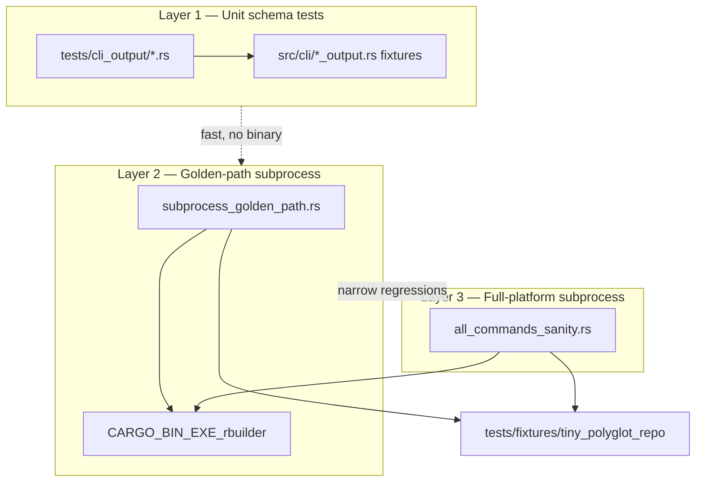

# CLI I/O sanity audit

Engineers use this document to understand **what** the CLI I/O test suites verify, **how** the subprocess harness works, and **where** to add coverage when changing serializers or flags.

The goal is a stable contract for:

- **Human operators** — text on stdout/stderr, progress on stderr, sensible exit codes.
- **Machine consumers** — deterministic JSON with versioned schemas, omitted keys instead of `null`, and composable topology arrays.

---

## Test architecture (three layers)



| Layer | Cargo target | Speed | Invokes binary? | Purpose |
|-------|--------------|-------|-----------------|---------|
| **1 — Unit schema** | `cli_output` | Fast (~ms) | No | Assert serde shapes from typed fixtures in `*_output.rs` |
| **2 — Golden path** | `subprocess_golden_path` | Medium | Yes | Narrow end-to-end paths: discover ingest, blast-radius v2, policy exit 1 |
| **3 — Full sanity** | `all_commands_sanity` | Slower (~1s) | Yes | One subprocess loop covering every JSON command + key platform rules |

Run everything:

```bash
cargo test --test cli_output --test subprocess_golden_path --test all_commands_sanity
```

**CI:** On every PR to `main`/`master`, [.github/workflows/blast-radius-perf.yml](../.github/workflows/blast-radius-perf.yml) runs release `phase16_blast_radius_perf` plus all three CLI I/O test targets.

Individual targets:

```bash
cargo test --test cli_output              # serializers only
cargo test --test subprocess_golden_path  # discover + blast-radius golden paths
cargo test --test all_commands_sanity     # comprehensive subprocess audit
```

---

## Subprocess harness (`all_commands_sanity.rs`)

### Design goals

1. **Never touch a developer tree** — each test copies `tests/fixtures/tiny_polyglot_repo` into a `tempfile::TempDir`.
2. **Explicit sandbox database** — graph writes go to `{temp}/sandbox_graph.db` via `-d`, not `{repo}/.rbuilder/`.
3. **Real binary** — uses `env!("CARGO_BIN_EXE_rbuilder")` so `cargo test` always runs the binary built for the current profile.
4. **Shared repo root** — `-r {temp_repo}` keeps paths stable for slice/inspect file arguments.

### `Sandbox` helper

| Method / field | Role |
|----------------|------|
| `Sandbox::new()` | Copies fixture into temp dir; sets `db = {temp}/sandbox_graph.db` |
| `sandbox.repo` | Root of the copied polyglot repo (Java + Rust) |
| `sandbox.db` | Isolated SQLite graph path passed as `-d` |
| `sandbox.run(args)` | Spawns `rbuilder -r {repo} -d {db} …args` and returns `Output` |
| `parse_stdout_json(output)` | Parses stdout as JSON; panics with stdout/stderr on failure |

### Assertion helpers

| Helper | Enforces |
|--------|----------|
| `assert_success` | Exit code 0 |
| `assert_exit_code(output, code, label)` | Exact UNIX exit (0 or 1) |
| `assert_schema_version(doc, n)` | Top-level `schema_version` |
| `assert_keys_present` | Required object keys exist |
| `assert_keys_absent_in_str` | Key names do not appear in serialized string (metrics omission rule) |
| `assert_no_nil_uuids` | Payload must not contain `00000000-0000-0000-0000-000000000000` |
| `assert_handoffs_empty_array` | `gatekeeping.handoffs` is `[]` when `--with-slices` omitted |

### Single test: `test_all_cli_commands_json_schema_sanity`

Execution order inside the test (each phase uses a fresh discover ingest unless noted):

| Step | Command (abbrev.) | Assertions |
|------|-------------------|------------|
| 1 | `discover . --languages java,rust` (text) | Success; stdout does **not** start with `{` |
| 2 | `-f json discover . --languages java,rust` | `schema_version: 2`, `command: discover`, metrics block keys |
| 3 | `-f json blast-radius OrderService::process` | v2 sections (`target`, `metrics`, `topology`, `gatekeeping`); Java `language` + `canonical_fqn`; empty `handoffs`; no nil UUIDs |
| 4 | `-f json gql …` / `--explain` | v1 bindings; `explain: false` then `true` |
| 5 | `-f json metrics --pagerank` / `--betweenness` / `--communities` | Each flag omits unrequested section keys |
| 6–6b | `-f json check` permissive / strict | exit 0 pass; exit 1 + `publishEvent` violation |
| 7–8 | `-f json slice` cfg / pdg / `--taint` | topology arrays vs flat taint schema |
| 9 | `-f json inspect checkout` cfg / pdg / dom | structured layers; integer `block_index` |
| 10 | blast-radius `--with-slices publishEvent` | non-empty `gatekeeping.handoffs` |
| 11 | blast-radius policy violation | exit 1 + `VIOLATED` |

**Separate test:** `test_discover_cli_flags` — `--exclude`, `-v`, `--security`, `--cfg`, `--all`.

**CLI note:** `inspect` takes a **layer subcommand** (`inspect SYMBOL dom`), not `--layer dom`.

---

## Fixture: `tests/fixtures/tiny_polyglot_repo`

Minimal polyglot repo used by all subprocess suites.

| Path | Contents |
|------|----------|
| `java/com/example/OrderService.java` | `OrderService::process` — primary blast-radius / disambiguation target |
| `java/com/example/OrderController.java` | `checkout` (inspect dom), `publishEvent` (unique symbol with caller for `check` policy tests) |
| `rust/src/lib.rs` | `process_labeled`, call chain for slice CFG/taint |
| `rust/src/main.rs` | Entry point for Rust discover |

**Known limits** (documented so engineers do not chase false failures):

1. **Rust `Calls` edges** — Rust plugin may not emit call edges in this tiny fixture; blast-radius/check upstream counts for Rust symbols can be zero.
2. **Duplicate bare names** — `process`, `helper`, etc. exist in both languages; blast-radius needs `Class::method` or `--class`; `check` skips ambiguous symbols via `resolve_unique_symbol`. Use `publishEvent` for subprocess scale-failure coverage.
3. **Re-discover after cache schema changes** — subprocess tests always run fresh discover; stale local `.rbuilder/` is not used.

---

## Layer 1 — Unit schema tests (`cargo test --test cli_output`)

These tests call **serializer fixtures** in `src/cli/*_output.rs` directly. They do not spawn the CLI. Add or extend a test here when changing JSON field names, optional-key rules, or fixture builders.

### Module map

| File | Serializer under test | Tests |
|------|----------------------|-------|
| `discover.rs` | `discover_output.rs` | `test_discover_json_schema_sanity`, `test_discover_build_maps_pipeline_stats` |
| `blast_radius.rs` | `blast_radius_output.rs` | `test_blast_radius_json_schema_sanity`, `test_blast_radius_symbol_context_shape`, `test_skipped_gatekeeping_always_has_empty_handoffs`, `test_blast_radius_target_v2_metadata` |
| `uuid_resolution.rs` | `blast_radius_output.rs` | `test_cache_entry_omits_unresolved_topology_without_nil_uuid` |
| `gql.rs` | `gql_output.rs` | `test_gql_json_schema_sanity`, `test_gql_empty_rows_explicit_array` |
| `metrics.rs` | `metrics_output.rs` | `test_metrics_json_schema_sanity`, `test_metrics_wrap_adds_schema_version`, `test_metrics_pagerank_only_omits_other_sections` |
| `check.rs` | `check_output.rs` | `test_check_json_schema_sanity`, `test_check_violations_always_array_when_passing`, `test_check_passed_false_contract` |
| `slice.rs` | `slice_output.rs` | `test_slice_cfg_json_schema_sanity`, `test_slice_cfg_topology_not_counts` |
| `inspect.rs` | `inspect_output.rs` | `test_inspect_cfg_json_schema_sanity`, `test_inspect_cfg_block_has_index` |

### What each command’s unit tests prove

#### `discover`

- `schema_version: 2`, `command: discover`
- Metrics object always includes: `files_discovered`, `files_indexed`, `files_skipped`, `nodes_generated`, `edges_generated`, `duration_ms`
- `build_discover_response` maps `PipelineStats` → JSON fields correctly

#### `blast-radius` (v2)

- Top-level: `target`, `metrics`, `topology`, `gatekeeping`
- `gatekeeping.handoffs` is always a present empty array when slices skipped
- Topology caller entries expose `id`, `fqn`, `file_path`
- Target v2: `language`, `canonical_fqn`; `signature` omitted when `None`
- `metrics.caller_depth_limit` present only when `--depth N` passed; `impact_zone_size` matches filtered zone
- `--depth N` post-filters cached/engine impact zones by incoming call hops (see [cli-output-schemas.md](cli-output-schemas.md) §1)
- Unresolved UUIDs in cache → caller dropped from topology (nil-UUID guardrail)

#### `gql`

- `schema_version: 1`, `rows`, `count`, `explain`
- Row cells: `binding`, `node`, `type`, `file`
- Empty result → `rows: []`, not omitted

#### `metrics`

- Full response includes all three sections when built with data
- Pagerank-only build: `betweenness` and `communities` keys **absent** (not `null`)
- `wrap_metrics_payload` injects `schema_version`

#### `check`

- Root: `policy`, `violations`, `passed`
- Passing run: `violations: []`
- `test_check_passed_false_contract`: serializer contract for `passed: false`
- Subprocess: `publishEvent` + `max_impact_nodes: 0` → exit **1** (see Layer 2 / Layer 3)

#### `slice`

- CFG view: `view`, `nodes`, `edges` arrays — not legacy scalar block counts
- `blocks` key must not appear in CFG JSON

#### `inspect`

- CFG layer fixture: `symbol`, `layer`, `nodes`, `edges`
- Nodes use stable `block_index` + `start_line` (not internal debug pointers)

---

## Layer 2 — Golden-path subprocess (`subprocess_golden_path.rs`)

Focused regressions that proved fragile during P2 work. Uses the same temp-copy fixture pattern but **default `-d`** (graph under `{repo}/.rbuilder/`) except where noted.

| Test | What it proves |
|------|----------------|
| `discover_json_emits_telemetry_on_stdout` | JSON mode: single telemetry object on stdout; no human `[✓] Indexed` lines on stdout |
| `discover_initializes_tiny_polyglot_repo` | Text discover creates `.rbuilder/graph.db` or snapshot |
| `blast_radius_json_exit_zero_after_discover` | Java `OrderService::process` via `--class`; v2 target metadata including `signature` |
| `blast_radius_policy_violation_fails_closed_with_exit_one` | `--policy-file` with `max_impact_nodes: 0` → exit **1**, `policy_status: VIOLATED` |
| `blast_radius_with_slices_populates_handoffs` | `--with-slices` on `publishEvent` → non-empty `handoffs` |
| `blast_radius_with_slices_under_30s_after_cfg_discover` | `discover --cfg` then `--with-slices` under 30s (`br.slice.total_ms`) |
| `check_policy_violation_fails_closed_with_exit_one` | `check` with `max_impact_nodes: 0` → exit **1** |

Add a golden-path test when a **specific** discover → command pipeline breaks in production but unit fixtures still pass.

---

## Global platform rules (enforced where marked)

| Rule | Unit | Subprocess | Notes |
|------|:----:|:----------:|-------|
| Deterministic `schema_version` | ✅ | ✅ | v2: `discover`, `blast-radius`; v1: others |
| Strict null elimination | ✅ | ✅ | Metrics sections omitted; `handoffs`/`violations`/`rows` as `[]` |
| No engine refactoring in I/O scope | — | — | Tests only touch `src/cli/*_output.rs` + discover emit |
| Isolated DB in full sanity | — | ✅ | `all_commands_sanity` uses `-d sandbox_graph.db` |
| Exit 0 on success | — | ✅ | All success paths |
| Exit 1 on policy breach | ✅ check serializer | ✅ check + blast-radius subprocess |

Architecture alignment: [Code_structure.md](Code_structure.md) — CLI thin, serializers in `*_output.rs`, cache enrichment in `rbuilder-analysis`.

---

## Coverage gaps

All items from the original audit matrix are now covered by subprocess and/or unit tests. When adding new CLI flags or JSON fields, extend:

- `tests/cli_output/all_commands_sanity.rs` — full-platform subprocess loop + `test_discover_cli_flags`
- `tests/cli_output/subprocess_golden_path.rs` — focused regressions
- `tests/cli_output/*.rs` — serializer unit fixtures

Future optional expansions (not required for baseline compliance):

| Area | Idea |
|------|------|
| `discover --verbose -f json` | Assert telemetry JSON when logging is redirected off stdout |
| `gql --explain` plan payload | Serialize `QueryResult.plan` in JSON when `--explain` is set |
| Rust `Calls` edges in fixture | Richer blast-radius/check paths for Rust symbols |

---

## Extending coverage

### Changed a JSON field in `*_output.rs`

1. Update the typed struct and `fixture_*` builder in the same file.
2. Fix the matching module under `tests/cli_output/`.
3. If the field is user-visible in subprocess output, add an assertion to `all_commands_sanity.rs` or `subprocess_golden_path.rs`.

### Added a new CLI JSON command

1. Create `src/cli/<cmd>_output.rs` with `SCHEMA_VERSION` constant and fixture.
2. Add `tests/cli_output/<cmd>.rs` and `mod <cmd>;` in `main.rs`.
3. Append a step to `test_all_cli_commands_json_schema_sanity`.
4. Document the schema in [cli-output-schemas.md](cli-output-schemas.md).

### Added a subprocess-only flag

Prefer asserting in `all_commands_sanity.rs` if the flag affects JSON shape or exit code; use `subprocess_golden_path.rs` for one critical pipeline only.

---

## Related docs

- [cli-output-schemas.md](cli-output-schemas.md) — field-by-field JSON reference
- [performance-engineering.md](performance-engineering.md) — blast-radius latency tiers, perf gates, discover/snapshot flags
- [blast-radius-json-schema-v2.md](blast-radius-json-schema-v2.md) — v2 target metadata
- [Code_structure.md](Code_structure.md) — where to put CLI vs analysis changes
