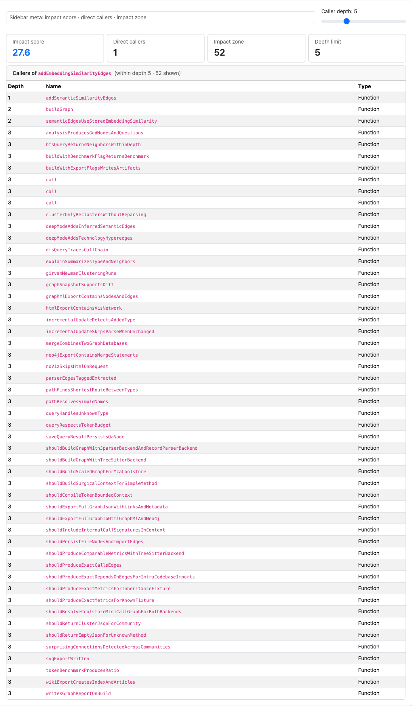
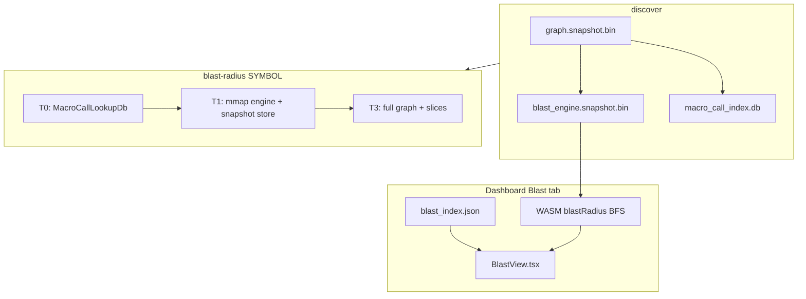

# Blast Radius — Engineering Design

Pre-computed **call-graph reachability** for change-impact analysis: upstream callers, impact scores, optional policy gates, and sub-second queries on large repos via mmap snapshots and a blast lookup cache.



*Figure 1: Dashboard **Blast Radius** tab — depth slider, impact score cards, and transitive caller table for a selected function.*

---

## 1. Goals

| Goal | How |
|------|-----|
| Answer “what breaks if I change this?” | Reverse call-graph traversal with SCC-aware macro impact |
| Stay fast at scale | T0 lookup cache → T1 mmap engine → optional socket daemon |
| Agent-ready output | JSON schema v2 (`target`, `metrics`, `topology`, `gatekeeping`) |
| Governance | Optional `--policy-file` centrality / cascade checks |

---

## 2. Architecture overview



**Query tiers** (`src/cli/blast_radius.rs`): T0 blast lookup cache hit → optional `serve --daemon` socket → lite mmap path → full hydrate for `--with-slices` / `--policy-file`.

---

## 3. Scoring and topology

- **Impact score** (0–100): macro SCC impact from pre-built `BlastRadiusEngine`
- **Direct callers**: immediate incoming `Calls` edges
- **Impact zone**: transitive upstream callers; capped by `--depth N`
- **Canonical identity**: `target.canonical_fqn` + UUIDs (not display `fqn` alone)

CLI JSON: [cli-output-schemas.md](../cli-output-schemas.md) §1 · [json-api.md](../json-api.md) §6.

---

## 4. Rust implementation map

| Component | Path |
|-----------|------|
| Engine + reachability | `crates/rbuilder-analysis/src/blast_radius_scc.rs` |
| Engine snapshot | `crates/rbuilder-analysis/src/blast_engine_snapshot.rs` |
| T0 lookup cache | `crates/rbuilder-analysis/src/macro_call_lookup.rs` |
| CLI orchestration | `src/cli/blast_radius.rs` |
| Socket daemon | `src/cli/query_daemon.rs` (`serve --daemon`) |
| Policy integration | `src/cli/policy_file.rs`, `engine.analyze_with_policy` |

---

## 5. Dashboard implementation

| Piece | Path |
|-------|------|
| Tab | `dashboard/src/BlastView.tsx` |
| WASM API | `blastRadius(nodeIndex, maxDepth)` in worker |
| Precomputed scores | `blast_index.json` (optional sort in sidebar) |
| Depth slider | Debounced re-query against WASM BFS |

---

## 6. CLI usage

```bash
rbuilder discover .
rbuilder -f json blast-radius ShoppingCartService
rbuilder -f json blast-radius process --class OrderService --depth 3
rbuilder -f json blast-radius Foo --policy-file policy.json   # exit 1 if VIOLATED
rbuilder serve --daemon   # optional blast socket warm path
```

---

## 7. Testing

| Layer | Location |
|-------|----------|
| Release perf gates | `tests/blast_radius_perf.rs` |
| Subprocess golden path | `tests/cli_output/subprocess_golden_path.rs` |
| JSON contract | `tests/cli_output/all_commands_sanity.rs` |
| Dashboard harness | `tests/dashboard_harness.rs` (`blast_index.json`) |

Regenerate screenshots:

```bash
rbuilder -r ~/git/java/gbuilder serve --port 8080
DASHBOARD_URL=http://127.0.0.1:8080/ node dashboard/scripts/capture-design-screenshots.mjs
```

---

## 8. Related docs

- [CI policy checks design](ci-policy-checks-design.md) — `check` and `--policy-file`
- [Graph storage architecture](../graph-storage-architecture.md) — snapshots and blast cache
- [CLI I/O sanity QE](../cli-io-sanity-qe.md) — automated gates
