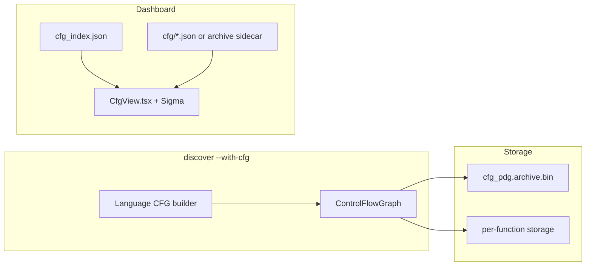

# Control-Flow Graph (CFG) — Engineering Design

Per-function **control-flow graphs**: basic blocks, branch edges, and loop structure — the same IR layer compilers use before optimization.


*Figure 1: **CFG / PDG Analysis** tab — function list, block table, and interactive CFG layout.*

---

## 1. Goals

| Goal | How |
|------|-----|
| Visualize executable structure | Basic blocks + conditional/unconditional edges |
| Feed PDG / slice / taint | Shared CFG construction in analysis pipeline |
| Scale to large repos | Inline JSON for small repos; `archive_only` lazy load for large |
| CLI dumps | `inspect SYMBOL cfg` (+ `--prune`, `-f mermaid`) |

---

## 2. Architecture overview



**Large repos:** `cfg_index.json` sets `detail_mode: "archive_only"` — UI offers **Load CFG graph** to fetch one function from the record pack on demand.

---

## 3. CFG schema (dashboard detail)

| Field | Meaning |
|-------|---------|
| `blocks[]` | `id`, `start_line`, `end_line`, `label` |
| `edges[]` | `from`, `to`, `kind` (`true`/`false`/`unconditional`) |
| `entry` / `exit` | Block ids |

---

## 4. Rust implementation map

| Component | Path |
|-----------|------|
| CFG IR | `crates/rbuilder-analysis/src/cfg.rs` |
| Language lowering | `crates/rbuilder-lang-*/` CFG hooks |
| Archive | `crates/rbuilder-analysis/src/cfg_pdg_archive.rs` |
| CLI inspect | `src/cli/inspect.rs` |
| Dashboard export | `crates/rbuilder-dashboard/src/cfg_export.rs` |

---

## 5. Dashboard implementation

| Piece | Path |
|-------|------|
| Tab | `dashboard/src/CfgView.tsx` |
| Graph render | Sigma.js with `CFG_NODE_LEGEND` / `CFG_EDGE_LEGEND` |
| Lazy load | `loadCfgDetail(functionId)` worker → archive records |
| Dominance table | Immediate dominators when detail includes `idom` |

---

## 6. CLI usage

```bash
rbuilder discover . --cfg
rbuilder inspect MyClass#myMethod cfg
rbuilder -f mermaid inspect MyClass#myMethod cfg --prune
rbuilder -f json inspect MyClass#myMethod cfg -o /tmp/cfg.json
```

---

## 7. Testing

| Layer | Location |
|-------|----------|
| CFG unit tests | `crates/rbuilder-analysis/src/cfg.rs`, `cfg_builder.rs` (`test_go_*`, `test_java_*`, `test_rust_*`, `test_c_*`, `test_cpp_*`) |
| Dashboard harness | `tests/dashboard_harness.rs` (`cfg_index.json`) |
| Playwright | `dashboard/scripts/test-graph-tabs.mjs` |

Screenshots: `capture-design-screenshots.mjs` → `docs/images/design/cfg/`.

### Go-specific notes

See [go-language-coverage.md](./go-language-coverage.md#go-cfg-lowering-tree-sitter) for the Tree-sitter Go checklist vs current lowering. Remaining honesty: `go` does not fork a parallel CFG; defer multiplicity inside loops is static-once.

### Java-specific notes

Shared `cfg_builder` now lowers Java:

| Surface | Lowering |
|---------|----------|
| `if` / `&&` `\|\|` | Unwrap `parenthesized_expression`; short-circuit via `wire_condition` |
| Classic `for` | Fields `init` / `condition` / `update`; `continue` → update block |
| `enhanced_for_statement` | Header branch + body cycle |
| `switch_statement` / `switch_expression` | `switch_block_statement_group` (implicit fallthrough) and `switch_rule` (arrow, no fallthrough); `return switch (...)` visits nested switch |
| Labels | `identifier ':' stmt` (no `label` field); labeled break/continue via `breakable_stack` |
| `try` / `try_with_resources` | Exception edges from try entry **and** body statement blocks to catch; `finally_stack` unwind on return/throw; resources emit synthetic `name.close()` (reverse order) before user `finally` |
| `throw_statement` | Inside try → Exception to catch; otherwise terminal `Exception` exit |

### Rust-specific notes

| Surface | Lowering |
|---------|----------|
| `if` / `if let` / `&&` `\|\|` | `let_condition` as branch; short-circuit via `wire_condition`; unwrap `else_clause` |
| `match` + guards | Sequential arms; guard `condition` short-circuits to next arm; arm `value` field visited (returns lower) |
| `try_expression` (`?`) | `IfTrue` success continue / `IfFalse` early `Return` exit |
| `for pat in iter` | Iterator expression + next/body cycle |
| `loop` | Unconditional body cycle; exit only via `break` / `return` / panic (no `IfFalse`) |
| `while` / `while let` | Condition header + body cycle |
| Labels | `'label:` embedded on loop nodes; `break`/`continue 'label` via `breakable_stack` |
| `panic!` / `todo!` / `unimplemented!` / `unreachable!` | `macro_invocation` → terminal `Exception` |
| `.await` | Branch marker + basic-block resume split |

Honesty left: implicit `Drop` cleanup blocks are not inserted; `async_block` / `closure_expression` are not separate sub-CFGs (nested control flow inside them is still walked when reachable).

### C-specific notes

| Surface | Lowering |
|---------|----------|
| `if` / `&&` `\|\|` | Unwrap `parenthesized_expression` and C++ `condition_clause`; short-circuit via `wire_condition` |
| `for` | Fields `initializer` / `condition` / `update`; `continue` → update |
| `do` / `while` | Body-then-condition cycle; condition on header block |
| `switch` / `case_statement` | Implicit fallthrough between cases; `default` = case with no `value` |
| Ternary | `conditional_expression` → IfTrue/IfFalse merge |
| `goto` / labels | `statement_identifier` label field; eager label blocks for forward jumps |
| `abort` / `exit` / `_Exit` | Terminal `Exception` exit |
| `setjmp` / `longjmp` | Record setjmp sites; longjmp `Jump` back (intra-procedural approx) |

Honesty left: computed `goto *ptr` not modeled; `longjmp` across functions is not inter-procedural; Duff’s-device case nesting relies on recursive case collection.

### C++-specific notes

| Surface | Lowering |
|---------|----------|
| C++17 `if` / `switch` init | `condition_clause.initializer` before `value` condition |
| `condition_clause` | Unwrap to `value` for short-circuit / branch text |
| `for_range_loop` | Range expr + begin/end-style header cycle |
| `try` / `catch` / `throw` | Exception edges; throw → catch or function exit |
| Ternary / `goto` / fallthrough | Same as C |
| Coroutines | `co_await` / `co_yield` suspend split; `co_return` as return |

Honesty left: RAII destructor cleanup blocks not inserted; overloaded `&&`/`||` still short-circuit (no type info); `lambda_expression` is not a separate sub-CFG.

### C#-specific notes

| Surface | Lowering |
|---------|----------|
| `if` / `&&` `\|\|` | Short-circuit via `wire_condition` (same as Java/C) |
| `for` | Init / condition / update; `continue` → update |
| `foreach` | Collection expr + `for-each` header cycle (`MoveNext`-style) |
| `switch_statement` / `switch_section` | Case fan-out; **no** implicit fallthrough; `when` guards before body |
| `switch_expression` / `switch_expression_arm` | Sequential pattern arms (C#); Java `switch_expression` falls back to statement lowering |
| `??` / `?.` | Null-coalesce and null-conditional branch splits |
| `try` / `catch` / `when` / `finally` | Exception edges; catch filter before body; finally on exit |
| `using` / `lock` | Finally-style `Dispose()` / `Monitor.Exit` on all exits (statement **and** `using var` declaration) |
| `await` | Async state-machine split: `IfTrue` resume / `IfFalse` suspend exit |
| `yield return` / `yield break` | Suspend split / terminal exit through finallies |
| `goto` / labels | Unconditional jump within method |
| `goto case` / `goto default` | Resolve to pre-created switch section entry blocks |
| Lambdas / local functions | Disconnected sub-CFG (`Jump` from definition); body returns use nested exit |

Honesty left: full async state-machine (multiple awaits / `MoveNext` resume table) is still a per-await bifurcate, not a global state enum; expression-bodied members and iterators beyond `yield` are not specialized further.

---

## 8. Related docs

- [PDG design](pdg-design.md) · [Dominance design](dominance-design.md)
- [Go language coverage](go-language-coverage.md) — LF-11…LF-15 CFG expectations
- [Dashboard design](../dashboard-design.md) — Phase 4 CFG export
