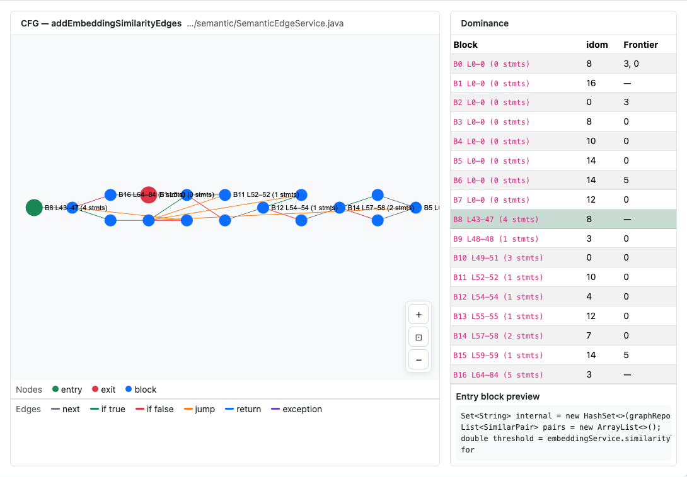
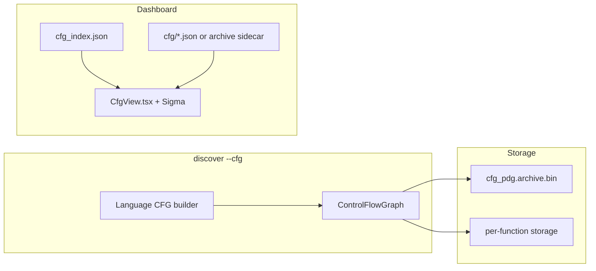

# Control-Flow Graph (CFG) — Engineering Design

Per-function **control-flow graphs**: basic blocks, branch edges, and loop structure — the same IR layer compilers use before optimization.



*Figure 1: **CFG / PDG Analysis** tab — function list, block table, and interactive CFG layout.*

---

## 1. Goals

| Goal | How |
|------|-----|
| Visualize executable structure | Basic blocks + conditional/unconditional edges |
| Feed PDG / slice / taint | Shared CFG construction in analysis pipeline |
| Scale to large repos | Inline JSON for small repos; `archive_only` lazy load for large |
| CLI dumps | `inspect SYMBOL cfg` (+ `--prune`, `-f mermaid`) |

---

## 2. Architecture overview



**Large repos:** `cfg_index.json` sets `detail_mode: "archive_only"` — UI offers **Load CFG graph** to fetch one function from the record pack on demand.

---

## 3. CFG schema (dashboard detail)

| Field | Meaning |
|-------|---------|
| `blocks[]` | `id`, `start_line`, `end_line`, `label` |
| `edges[]` | `from`, `to`, `kind` (`true`/`false`/`unconditional`) |
| `entry` / `exit` | Block ids |

---

## 4. Rust implementation map

| Component | Path |
|-----------|------|
| CFG IR | `crates/rbuilder-analysis/src/cfg.rs` |
| Language lowering | `crates/rbuilder-lang-*/` CFG hooks |
| Archive | `crates/rbuilder-analysis/src/cfg_pdg_archive.rs` |
| CLI inspect | `src/cli/inspect.rs` |
| Dashboard export | `crates/rbuilder-dashboard/src/cfg_export.rs` |

---

## 5. Dashboard implementation

| Piece | Path |
|-------|------|
| Tab | `dashboard/src/CfgView.tsx` |
| Graph render | Sigma.js with `CFG_NODE_LEGEND` / `CFG_EDGE_LEGEND` |
| Lazy load | `loadCfgDetail(functionId)` worker → archive records |
| Dominance table | Immediate dominators when detail includes `idom` |

---

## 6. CLI usage

```bash
rbuilder discover . --cfg
rbuilder inspect MyClass#myMethod cfg
rbuilder -f mermaid inspect MyClass#myMethod cfg --prune
rbuilder -f json inspect MyClass#myMethod cfg -o /tmp/cfg.json
```

---

## 7. Testing

| Layer | Location |
|-------|----------|
| CFG unit tests | `crates/rbuilder-analysis/src/cfg.rs` |
| Dashboard harness | `tests/dashboard_harness.rs` (`cfg_index.json`) |
| Playwright | `dashboard/scripts/test-graph-tabs.mjs` |

Screenshots: `capture-design-screenshots.mjs` → `docs/images/design/cfg/`.

---

## 8. Related docs

- [PDG design](pdg-design.md) · [Dominance design](dominance-design.md)
- [Dashboard design](../dashboard-design.md) — Phase 4 CFG export
