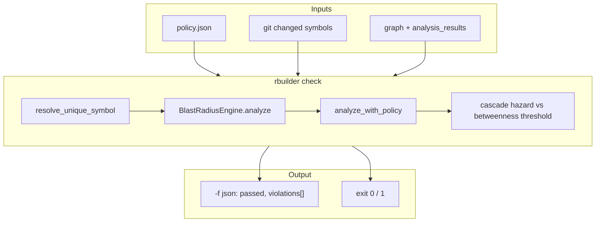

# CI Policy Checks — Engineering Design

**`rbuilder check`** — fail CI when blast-radius policy rules are violated on symbols touched in the current git working tree. Complements interactive **`blast-radius --policy-file`** gatekeeping.


*Figure 1: **Blast Radius** tab — impact scores and caller fan-in that inform policy thresholds. Policy enforcement itself runs in CI via `check` (CLI); there is no separate dashboard tab.*

---

## 1. Goals

| Goal | How |
|------|-----|
| Block risky merges | Exit code `1` when violations found |
| Scope to changes | `git diff` changed functions (fallback: all functions) |
| Reuse blast engine | Same `BlastRadiusEngine` + centrality as `blast-radius` |
| Declarative rules | JSON policy file — see [policy-format.md](../policy-format.md) |

---

## 2. Architecture overview



**`blast-radius --policy-file`:** evaluates policy on a **single** symbol; emits `gatekeeping.policy_status` (`PASSED` / `VIOLATED` / `SKIPPED`) and may exit `1` after printing JSON.

---

## 3. Policy rule types

| Rule | Trigger |
|------|---------|
| `max_blast_score` | Target impact score exceeds cap |
| `max_impact_zone_size` | Transitive caller count too large |
| `centrality_alert_threshold` | Upstream node betweenness in impact zone |
| Custom registry entries | `PolicyFile` → `PolicyRegistry` |

Example files: [policy-permissive.json](../examples/policy-permissive.json), [policy-strict.json](../examples/policy-strict.json).

---

## 4. Rust implementation map

| Component | Path |
|-----------|------|
| `check` command | `src/cli/check.rs` |
| JSON output | `src/cli/check_output.rs` |
| Policy load | `src/cli/policy_file.rs` |
| Engine | `crates/rbuilder-analysis/src/blast_radius_scc.rs` |
| Centrality | `crates/rbuilder-analysis/src/centrality.rs` |
| Git diff symbols | `src/cli/check.rs` (`changed_function_symbols`) |

---

## 5. Dashboard relationship

Policy is **CLI-first**. The dashboard helps **calibrate** thresholds:

- **Blast Radius** tab — empirical scores and caller counts
- **Functions** tab — betweenness / PageRank for cascade hazard tuning
- **Migration** tab — package risk context (orthogonal to per-PR `check`)

---

## 6. CLI usage

```bash
# One-off blast with policy gate
rbuilder -f json blast-radius ShoppingCartService --policy-file policy.json

# CI on PR — evaluate changed functions
rbuilder check --policy-file policy.json
rbuilder -f json check --policy-file policy.json | jq '.passed, .violations'
```

Typical GitHub Actions pattern: run `discover` in a setup job, then `check` on each PR with the same `.rbuilder/` cache artifact.

---

## 7. Testing

| Layer | Location |
|-------|----------|
| Subprocess contract | `tests/cli_output/all_commands_sanity.rs` (`check` pass/fail) |
| Policy parsing | `src/cli/policy_file.rs` tests |
| Blast gatekeeping | `all_commands_sanity` blast-radius + policy exit 1 |

Screenshots: `capture-design-screenshots.mjs` → `docs/images/design/ci-policy-checks/`.

---

## 8. Related docs

- [Policy format](../policy-format.md)
- [Blast radius design](blast-radius-design.md)
- [Agent recipes](../agent-recipes.md) — CI workflow examples
