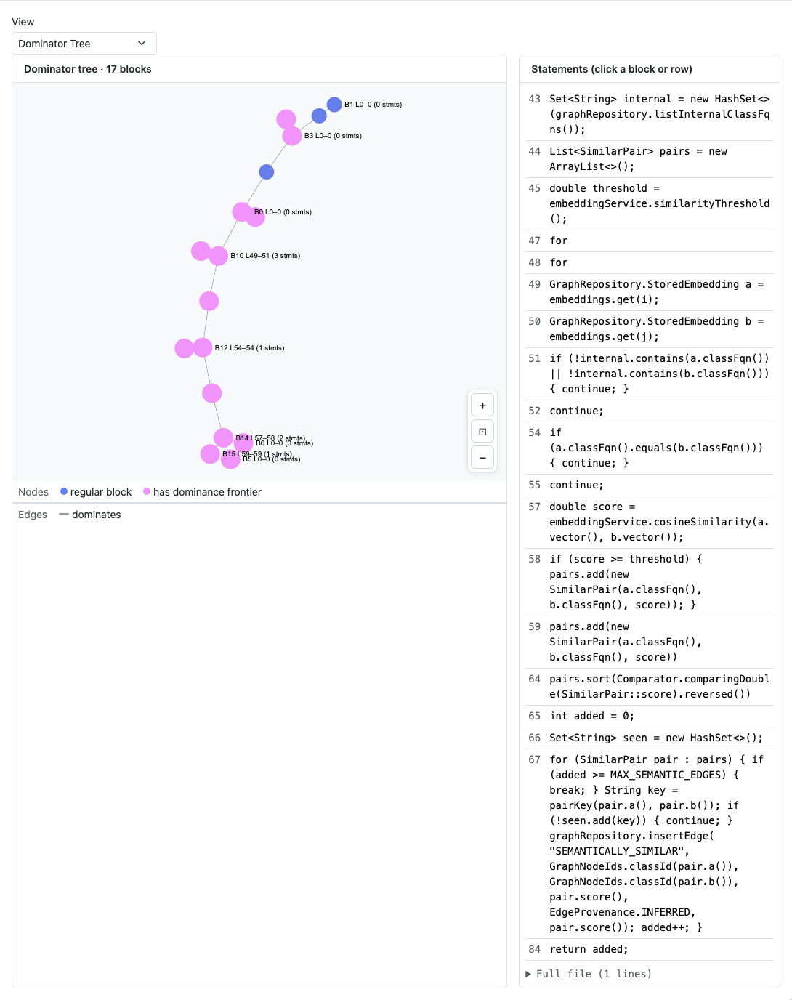
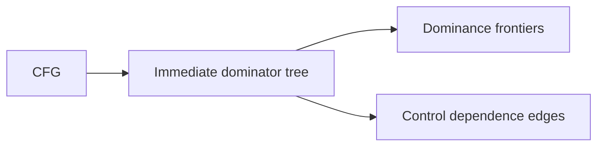

# Dominance — Engineering Design

**Dominator trees** and **dominance frontiers** — compiler structures that identify where control joins and where definitions reach. Exposed via `inspect dom` and the dashboard **Dataflow** tab’s dominator mode.



*Figure 1: **Dataflow** tab with view mode **Dominator Tree** — tree layout and statement list with frontier sizes.*

---

## 1. Goals

| Goal | How |
|------|-----|
| Immediate dominators | Classic Cooper–Harvey–Kennedy style tree per function |
| Dominance frontiers | Nodes where control from multiple predecessors meet |
| PDG input | Control-dependence edges derived from dominance |
| Developer visibility | Same CFG export powers CLI + dashboard |

---

## 2. Theory → implementation



For each edge `A → B` in the CFG, if `B` does not strictly dominate `A`, add control dependence from the **immediate dominator of B** to `B`.

---

## 3. CLI output

```bash
rbuilder inspect Symbol dom
rbuilder inspect Symbol dom --frontiers
rbuilder -f json inspect Symbol dom -o dom.json
```

JSON includes `nodes[]` with `idom`, `frontier_size` when `--frontiers` is set.

---

## 4. Rust implementation map

| Component | Path |
|-----------|------|
| Dominator algorithm | `crates/rbuilder-analysis/src/dominance.rs` |
| CFG integration | `crates/rbuilder-analysis/src/cfg.rs` |
| PDG control edges | `crates/rbuilder-analysis/src/pdg.rs` |
| CLI inspect | `src/cli/inspect.rs` |

---

## 5. Dashboard implementation

| Piece | Path |
|-------|------|
| View toggle | `DataflowView.tsx` → `viewMode: "dominator"` |
| Graph layout | `computeDominatorGraph()` in `dataflowEngine.ts` |
| Node sizing | Larger nodes when `frontier_size > 0` |
| Legends | `DOMINATOR_NODE_LEGEND`, `DOMINATOR_EDGE_LEGEND` |

---

## 6. Testing

| Layer | Location |
|-------|----------|
| Dominance tests | `crates/rbuilder-analysis/src/dominance.rs` |
| Semantic verification | `scripts/semantic-verification.sh` |

Screenshots: `capture-design-screenshots.mjs` → `docs/images/design/dominance/`.

---

## 7. Related docs

- [CFG design](cfg-design.md) · [PDG design](pdg-design.md)
- [Further reading](../further-reading.md) — compiler analysis references
