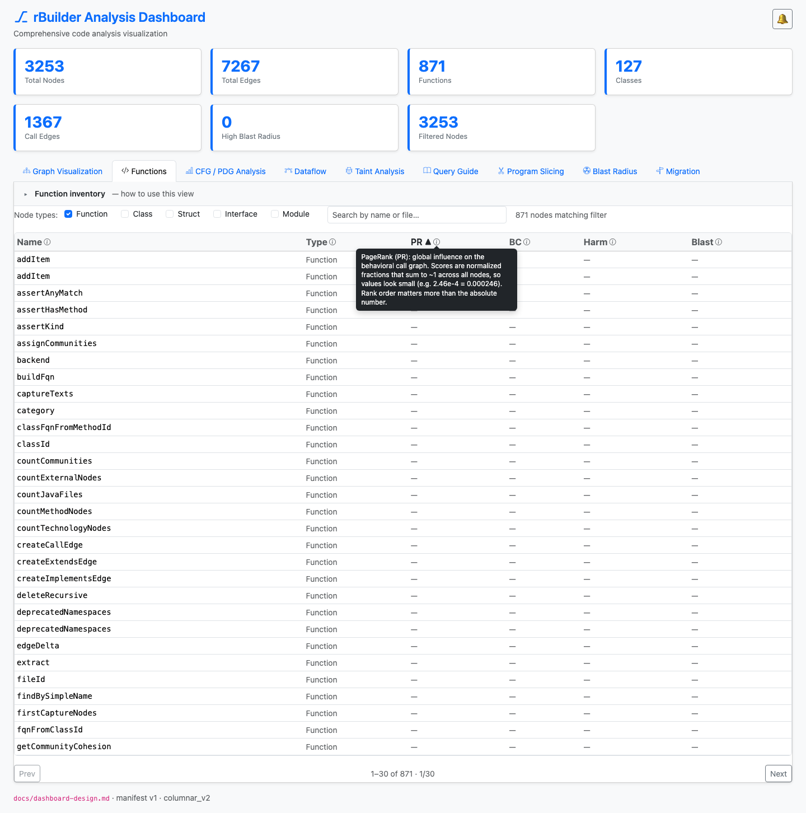
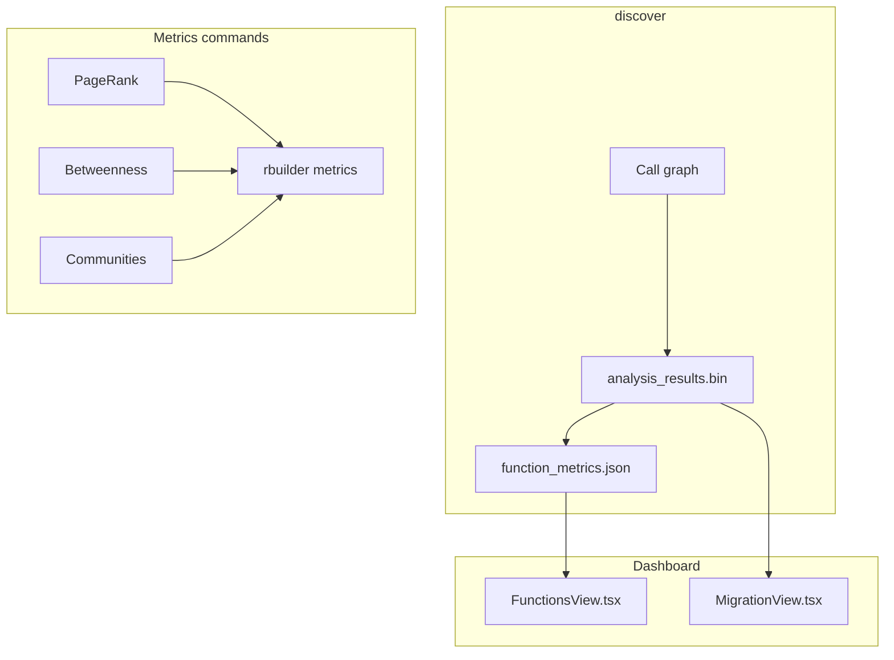

# Graph Metrics — Engineering Design

**Network analytics** on the live call graph: PageRank, betweenness centrality, and community detection — computed at `discover` and surfaced in the **Functions** tab and migration planner.



*Figure 1: **Functions** tab — sortable PageRank (PR), betweenness (BC), harmonic (Harm), and blast columns over the full function inventory.*

---

## 1. Goals

| Goal | How |
|------|-----|
| Find architectural hotspots | PageRank + betweenness on call graph |
| Migration batching | Communities (label propagation) + harmonic centrality |
| Agent ranking | `-f json metrics --pagerank` |
| Dashboard sort/filter | WASM-paginated function table |

---

## 2. Architecture overview



---

## 3. Metrics reference

| Metric | Meaning | Used in |
|--------|---------|---------|
| **PageRank** | Global importance in call graph | Functions tab, migration α term |
| **Betweenness** | Bridge / bottleneck score | Functions tab, policy cascade hazard |
| **Harmonic** | Reachability closeness | Functions tab, migration β term |
| **Communities** | Label-propagation clusters | Graph colors, migration Louvain vote |
| **Blast score** | Precomputed impact (per function) | Functions tab, migration γ term |

Background: [harmonic-centrality.md](../harmonic-centrality.md), [migration-algorithms.md](../migration-algorithms.md).

---

## 4. Rust implementation map

| Component | Path |
|-----------|------|
| Centrality | `crates/rbuilder-analysis/src/centrality.rs` |
| Communities | `crates/rbuilder-analysis/src/community.rs` |
| Harmonic | `crates/rbuilder-analysis/src/harmonic.rs` |
| Persist | `crates/rbuilder-analysis/src/analysis_results.rs` |
| CLI | `src/cli/metrics.rs` |
| Dashboard export | `crates/rbuilder-dashboard/src/function_metrics_export.rs` |

---

## 5. Dashboard implementation

| Piece | Path |
|-------|------|
| Tab | `dashboard/src/FunctionsView.tsx` |
| Data | WASM `list_nodes` + `function_metrics.json` merge |
| Sort | Column headers PR / BC / Harm / Blast |
| Tooltips | `FUNCTION_COLUMN_TOOLTIPS` in `functionListUtils.ts` |

Graph tab uses `communities.json` / metagraph Louvain colors for package view.

---

## 6. CLI usage

```bash
rbuilder discover .
rbuilder metrics
rbuilder -f json metrics --pagerank --iterations 50
rbuilder -f json metrics --betweenness
rbuilder -f json metrics --communities
```

`discover` already computes core metrics; `metrics` re-emits them as JSON without re-indexing.

---

## 7. Testing

| Layer | Location |
|-------|----------|
| Analysis unit tests | `crates/rbuilder-analysis/src/centrality.rs`, `community.rs` |
| CLI subprocess | `tests/cli_output/all_commands_sanity.rs` |
| Dashboard harness | `tests/dashboard_harness.rs` (`function_metrics.json`) |

Screenshots: `capture-design-screenshots.mjs` → `docs/images/design/graph-metrics/`.

---

## 8. Related docs

- [Migration planner design](migration-planner-design.md)
- [Blast radius design](blast-radius-design.md)
- [GQL design](gql-design.md)
