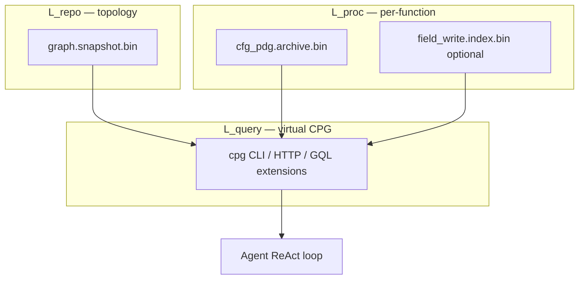

# Hybrid CPG (two-resolution) — Implementation plan

**Goal:** Reach **Joern-style CPG query capability** for agent loops (mutation proof, data slice, call bridging) without collapsing the whole repo into one mega-graph or regressing default `discover` performance.

**Architecture (Option 6):**

```text
L_repo   = CALL + type + Contains (+ existing Uses/…)  → graph.snapshot.bin   (always)
L_proc   = CFG + DFG/PDG [+ field writes] [+ optional AST skeleton] → cfg_pdg archive / on-demand
L_query  = virtual CPG API joins L_repo ⟷ L_proc by function UUID (+ call sites)
```

**Driving use case:** Prove `OrderDTO` fields are never mutated outside constructors before converting to a Java `record` (see §8). Grep/setters alone are insufficient; agents need typed field-write reachability + local data slices.

**Non-goals (this plan):**

- Joern/Neo4j as primary store; full-repo fused CPG in `graph.snapshot.bin`
- Full AST `PARENT`/`CHILD` for every syntax node in default discover
- Sound points-to / must–may alias as v1 (tier later; see DFG tiers)
- Claiming absolute “100% safety” against reflection / frameworks / JNI

**Related:** [analysis-architecture.md](../analysis-architecture.md), [cfg-design.md](cfg-design.md), [pdg-design.md](pdg-design.md), [program-slicing-design.md](program-slicing-design.md), [gql-design.md](gql-design.md), [taint-analysis-design.md](taint-analysis-design.md).

---

## 1. Why this shape

| Concern | Choice |
|---------|--------|
| Scale (linux-class repos) | Keep topology digest stable; deep facts stay opt-in sidecars |
| Agent UX | One **CPG view** API, not “remember three CLIs” |
| Mutation queries | Need **typed field writes**, not only name-based PDG locals |
| Incremental | L_proc rebuilds with CFG archive; L_repo unchanged by CPG façade |
| Interop | Optional export phase later; not blocking hybrid query |



**Invariant:** Default `discover` (no `--with-cfg`) never builds L_proc or field-write index. Snapshot digest rules unchanged ([analysis-architecture.md](../analysis-architecture.md)).

---

## 2. Phased delivery

| Phase | Outcome | User-visible |
|-------|---------|--------------|
| **P0** | CPG façade over existing CFG/PDG + CALL | `rbuilder cpg …` / HTTP; docs for agents |
| **P1** | Field-write IR + type-linked mutation index | OrderDTO Turn-2 query works on fixtures |
| **P1 status** | **Shipped:** `field_write.index.bin`, `cpg mutations --type … --exclude-ctors` | |
| **P2** | Unified slice / flows in CPG API | OrderDTO Turn-5 without separate mental model |
| **P2 status** | **Shipped:** `cpg flows` + shared `ForwardSlicer` | |
| **P3** | DFG fidelity tiers (loop / must–may opt-in) | Fewer false negatives on hard dataflow |
| **P3 status** | **Shipped:** `--with-dfg-loops`, `cpg flows --with-alias` | |
| **P4** | Optional AST skeleton + CPG export | Syntax queries + Joern/Neo4j interop |
| **P4 status** | **Shipped:** `--with-ast-skeleton`, `cpg ast`, `cpg export` | |

Ship **P0→P2** before P3/P4. P1 is the gate for the record-refactor agent story.

---

## 3. Phase 0 — Virtual CPG façade (no new IR)

### Problem
Agents must stitch `gql` / `blast-radius` / `inspect` / `slice` and know `--with-cfg`. No single “CPG” entrypoint.

### Design

- **Do not** duplicate CFG/PDG into the snapshot.
- Add a thin **join layer** that loads:
  - `PreparedGraphSnapshot` / cold metadata for L_repo
  - `CfgPdgArchive` when present (else clear error: run `discover --with-cfg`)
- Surface stable JSON schemas (`schema_version`) under `-f json`.

### Steps

1. **Module** — `crates/rbuilder-analysis/src/cpg/` (or `cpg_query.rs`):
   - `CpgContext { graph, archive, call_graph }`
   - Resolvers: `function_by_name`, `type_by_name`, `cfg(fn)`, `pdg(fn)`
2. **CLI** — `rbuilder cpg` subcommands (v0):
   - `cpg status` — archive present? function count with CFG/PDG
   - `cpg function <name>` — L_repo node + whether L_proc exists
   - `cpg calls <name>` — CALL neighborhood from snapshot (bridge demo)
   - `cpg pdg <name> [--edge-layer data|control]` — thin wrap of inspect
   - `cpg slice <file> --line N --variable V …` — thin wrap of slice
3. **HTTP** — `POST /api/cpg` with `{ "op": "…", … }` mirroring CLI (same JSON shapes as `-f json`); wire in `serve`.
4. **Docs** — AGENTS.md + agent-recipes: “prefer `cpg` when reasoning across control/data/calls”; note requires `--with-cfg`.
5. **Tests** — Fixture with one Java/Rust function: status ok; slice/pdg round-trip through façade.

### Acceptance

- After `discover --with-cfg`, agent can run mutation/slice workflows via `cpg` without inventing multi-tool glue (even if mutation query still missing until P1).
- Default discover unchanged (no new artifacts).

### Perf

- Façade is load-on-query only; no discover-time cost.

---

## 4. Phase 1 — Field writes + typed mutation index (OrderDTO Turn 2)

### Problem
Joern: `cpg.typeDecl.name("OrderDTO").member…assignment.filterNot(_.method.name == "<init>")`.

Today:

- Class nodes exist; **members are not first-class write targets** in L_proc.
- PDG def/use is **identifier-name** based; `order.status = …` does not reliably produce a typed write to `OrderDTO.status`.
- No repo-wide “all writes to type T’s fields” query.

### Design

**Field write fact** (stored in L_proc record and/or compact index):

| Field | Meaning |
|-------|---------|
| `function_id` | Enclosing method UUID (L_repo) |
| `is_constructor` | true for `<init>` / language ctor |
| `receiver_local` | e.g. `order` (optional) |
| `receiver_type` | Resolved type name / FQN when known |
| `member` | Field name e.g. `status` |
| `file`, `line`, `code_snippet` | For agent observation |
| `kind` | `DirectField` \| `ThisField` \| … |

**Resolution v1 (soundness-bounded):**

1. LHS is `field_access` / equivalent (`obj.f`, `this.f`).
2. Resolve `obj`’s type from: local decl, parameter type, field type of enclosing class (reuse Java `find_field_type`-style helpers; extend per language plugin).
3. Map to L_repo `Class`/`Struct` by name/FQN when possible; store type string even if Class UUID missing.
4. Skip unresolved receivers into `kind=Unresolved` bucket (queryable with flag; not counted as proof).

**Index:** Prefer **sidecar** `.rbuilder/analysis/field_write.index.bin` (function_id → writes, secondary map type→writes) built during `--with-cfg` pass—avoid bloating every PDG if scan-only is enough. Rebuild when archive rebuilds; invalidate with same digest rules as other sidecars.

**Do not** stamp field-write edges into `graph.snapshot.bin` in v1 (digest + RSS). Optional later: `Modifies` edges Function→Variable if Variable nodes for fields are extracted.

### Steps

1. **Def/use fix** — In `def_use.rs` (and CFG statement extraction): treat field-access LHS as **write to member** (record `member` + base), not silent no-def / wrong local-only def.
2. **Type recovery helper** — Shared in analysis or lang plugins: `resolve_local_type(fn_ast, local) -> Option<TypeName>` for Java first (driving case); stub other langs.
3. **Extract writes** — During CFG/PDG build (or post-pass over CFG statements + source), emit `Vec<FieldWrite>` into `CfgPdgRecord` **or** parallel index writer.
4. **Query API** — `cpg mutations --type OrderDTO [--exclude-ctors] [--member status]`:
   - Returns file/line/code JSON list
   - Filters `is_constructor` when requested
5. **GQL (optional P1.5)** — Virtual pattern or macro `field_mutations(type, …)` documented as overlay (like `:Community`); not topology edges.
6. **Setter policy (P1b)** — Also list `Calls` into `setX` / known mutators on type (name heuristic + optional config). Document as **advisory**, not complete.
7. **Fixture** — `OrderDTO` + `OrderProcessor` with `order.status = "PROCESSED"`; assert mutation query finds exactly that line; ctor assigns excluded.
8. **Negative** — Unrelated class with `.status =` must not appear when type resolves; unresolved writes appear only with `--include-unresolved`.

### Acceptance

- Turn 2 of the record-refactor loop works on the Java fixture via `rbuilder -f json cpg mutations --type OrderDTO --exclude-ctors`.
- Empty result ⇒ agent may proceed to record conversion **under documented resolution limits**.
- `--with-cfg` wall time / RSS: measure on ecommerce-java; no default-discover impact. Target: index build ≪ CFG/PDG build (profile stage `[profile] field_writes`).

### Perf

- Opt-in with `--with-cfg` only.
- Index size O(#field writes), not O(AST).
- Query: O(writes for type) via inverted map; avoid full archive deserialize if index is standalone.

---

## 5. Phase 2 — Flows / slice in the CPG API (OrderDTO Turns 5–6)

### Problem
Agents switch to `slice` / Joern `reachableByFlows` mentally; hybrid CPG should expose one vocabulary.

### Design

Map:

| CPG concept | rBuilder |
|-------------|----------|
| `reachableByFlows` (forward) | Forward PDG slice / data-dep BFS |
| Backward slice | Existing `slice` default |
| Interproc (best-effort) | Existing interprocedural slicer when archive + call graph allow |

### Steps

1. **`cpg flows`** — `--file --line --variable [--direction forward|backward] [--function] [--interprocedural]`
   - Reuse `slicing.rs` / interprocedural path; JSON schema aligned with `slice` (`schema_version`).
2. **Handoff recipe** — Docs: mutations → pick site → `cpg flows` on receiver local → decide wither/copy.
3. **Agent recipe** — Copy-paste ReAct loop for DTO→record in [agent-recipes.md](../agent-recipes.md).
4. **Tests** — Fixture flow: find → mutate → return; forward flows lists assign, write, return lines.

### Acceptance

- Turns 5–6 runnable solely through `cpg` (+ discover `--with-cfg`).
- Token story: JSON returns locs/snippets; agent need not load whole files.

---

## 6. Phase 3 — DFG fidelity tiers (opt-in)

Tighten L_proc data edges without changing L_repo.

| Tier | Flag (illustrative) | Adds |
|------|---------------------|------|
| T0 | (default with `--with-cfg`) | Today’s Flow/Anti/Output (name-based) |
| T1 | `--with-dfg-loops` | Loop-carried dependence classification |
| T2 | `--with-dfg-alias` / on-demand | Must/May alias for selected functions |

### Steps

1. Design note in [pdg-design.md](pdg-design.md): tier flags, archive schema bump if needed.
2. Implement T1 on CFG back-edges; expose on `DataDep` or parallel tag.
3. T2 on-demand for `cpg flows` / `inspect` (never whole-linux default).
4. Benchmarks: ecommerce-java + one medium C repo; gate default T0.

### Acceptance

- Documented false-negative classes shrink for loop-heavy code when T1 enabled.
- Default `--with-cfg` cost remains T0-class.

---

## 7. Phase 4 — AST skeleton + export (optional)

### 4a AST skeleton (sidecar only)

- Coarse nodes: decl, block, if, loop, call, assign — plus nesting edges — **per function or per file**, not in snapshot.
- Enables syntax-oriented queries; not required for OrderDTO mutation if field-write IR exists.

### 4b Export

- `rbuilder cpg export --format graphml|graphson` materializing L_repo CALL/type ∪ selected L_proc edges for one package or whole repo (explicit scope).
- No change to primary store.

### Acceptance

- Export validates on small fixture; large export is opt-in and scoped.

---

## 8. Driving scenario — acceptance script

End-to-end agent simulation (CI or `tests/` harness):

```text
1. discover fixture --with-cfg
2. cpg mutations --type OrderDTO --exclude-ctors
   → exactly OrderProcessor.java:114 (or fixture line)
3. cpg flows --file OrderProcessor.java --line 114 --variable order --direction forward
   → includes assign, field write, return
4. (manual/agent) apply record + withStatus; re-discover
5. cpg mutations --type OrderDTO --exclude-ctors → empty
```

Document known gaps: reflection, `Object` receivers without cast, cross-language, Lombok-generated setters unless bytecode/source present.

---

## 9. API sketch (stable for agents)

```bash
rbuilder -r "$REPO" discover . --with-cfg

rbuilder -r "$REPO" -f json cpg status
rbuilder -r "$REPO" -f json cpg mutations --type OrderDTO --exclude-ctors
rbuilder -r "$REPO" -f json cpg flows \
  --file src/.../OrderProcessor.java --line 114 --variable order --direction forward
rbuilder -r "$REPO" -f json cpg calls OrderProcessor::process
```

HTTP: `POST /api/cpg` with the same `op` + args; stdout/JSON only on success path (stderr diagnostics).

GQL: keep topology pure; add macros or documented virtual ops rather than fake `ASSIGNMENT` topology edges in v1.

---

## 10. Schema / storage

| Artifact | Role | When written |
|----------|------|--------------|
| `graph.snapshot.bin` | L_repo | Always (unchanged role) |
| `analysis/cfg_pdg.archive.bin` | L_proc CFG/PDG (+ optional embedded field writes) | `--with-cfg` |
| `analysis/field_write.index.bin` | Inverted mutation index | `--with-cfg` (P1) |
| (future) `analysis/ast_skeleton…` | Coarse AST | P4 opt-in |

Bump archive / index **version** fields; reject stale with clear CLI errors. Invalidate on graph digest change like other sidecars.

---

## 11. Testing strategy

| Layer | Focus |
|-------|--------|
| Unit | `def_use` field-access write; type resolve; mutation filter ctors |
| Integration | OrderDTO fixture script (§8) |
| Perf | `--with-cfg` + field index vs baseline on ecommerce-java; RSS/wall in CI job or manual profile log |
| JSON schema | `cli-output-schemas.md` + golden `-f json` |

---

## 12. Docs & agent surface

| Doc | Update |
|-----|--------|
| AGENTS.md | Hybrid CPG commands table |
| agent-recipes.md | DTO→record ReAct recipe |
| user-guide.md | `cpg` section; link CFG requirement |
| http-api.md | `/api/cpg` |
| This plan → later | Split into `hybrid-cpg-design.md` after P2 ships (screenshots if UI) |

Dashboard: **not required** for P0–P2 (CLI/HTTP agent-first). Optional later: mutations panel.

---

## 13. Risk register

| Risk | Mitigation |
|------|------------|
| Type recovery too weak → false “safe” | Require `--exclude-unresolved` default off for “proof” mode; print unresolved count |
| Index doubles archive I/O | Standalone mmap index; lazy per-type |
| Agents expect Joern CPGQL | Document mapping table; do not pretend Scala DSL |
| Scope creep into unified store | Explicit non-goal; review any PR touching snapshot digest for CPG |

---

## 14. Suggested implementation order (engineering)

1. P0 façade + docs (unblocks agent vocabulary)
2. P1 def/use + Java type recovery + index + `cpg mutations` + fixture
3. P2 `cpg flows` + recipe + E2E script
4. P1b setter advisory
5. P3 tiers as needed by false-negative reports
6. P4 export / AST only if demanded

**Estimate (rough):** P0 small; P1 medium–large (lang-sensitive); P2 small if reuse slice; P3 medium; P4 medium.

---

## 15. Language readiness (Layer F)

Hybrid CPG quality is gated by language plugins. **Layer F is required for every Tier 1 language** (Java sets the bar). Full checklist: [tier-1-language-support.md § Layer F](../tier-1-language-support.md).

| Status | Languages |
|--------|-----------|
| **Parity shipped** | Java, C#, Go, C, C++, TypeScript, JavaScript, Python, Rust — fields/ctors/typed params + `field_write` golden mutation tests + `field_write_locals` merge |

Do **not** put full type checkers in plugins. Bound resolution: decl / param / field / import. Dynamic languages (JS/Python without annotations) may still return more `Unresolved` receivers — that is expected, not a pass to skip F1–F6 shapes.

---

## 16. Exit criteria for “hybrid CPG v1”

- [x] L_repo / L_proc / L_query separation documented and enforced (no field-write edges in snapshot digest)
- [x] `cpg mutations` + `cpg flows` cover OrderDTO-style fixture loop
- [x] **All Tier 1 languages** meet Layer F1–F6 (Java-shaped) on fixtures
- [x] Default discover perf unchanged (L_proc / field-write opt-in via `--with-cfg`)
- [x] Agent recipe published; AGENTS.md updated
- [x] Honesty limits documented (alias, reflection, unresolved receivers)
