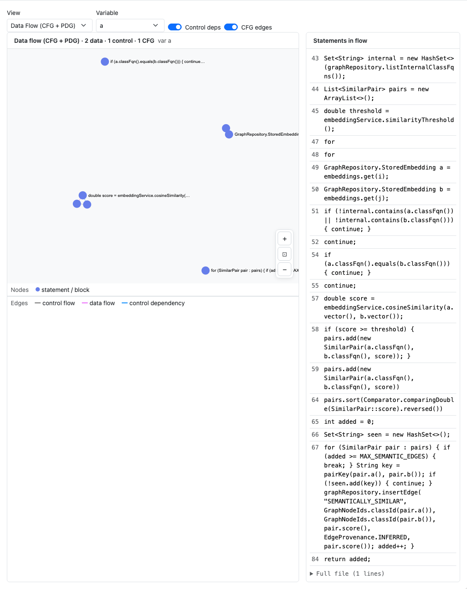
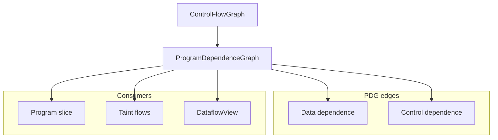

# Program Dependence Graph (PDG) — Engineering Design

**Program dependence graph** — data and control dependencies between statements within a function. Foundation for slicing, taint, and dataflow visualization.



*Figure 1: **Dataflow** tab in PDG mode — variable selector, control/data edge toggles, and Sigma PDG layout.*

---

## 1. Goals

| Goal | How |
|------|-----|
| Statement-level deps | Data edges (def-use) + control edges |
| Slice foundation | Backward/forward slice = graph reachability |
| Interactive exploration | Dashboard variable filter + statement list |
| CLI export | `inspect SYMBOL pdg` with `--edge-layer data|control` |

---

## 2. Architecture overview



PDG is built after CFG dominator analysis (`crates/rbuilder-analysis/src/pdg.rs`).

### Opt-in fidelity (hybrid CPG P3)

| Flag / option | Effect |
|---------------|--------|
| `discover --with-dfg-loops` | Sets `PdgBuildOptions::classify_loop_carried` — tags `DataDependency.loop_carried` when the use block can reach the def block on the CFG (loop-carried) |
| `cpg flows --with-alias` | On-demand may-alias expansion (`alias::may_alias_names`) for copies + field bases; does not rewrite the PDG archive |

Default `discover --with-cfg` leaves `loop_carried = false` on all edges.

---

## 3. Dashboard dataflow mode

| Control | Effect |
|---------|--------|
| Variable dropdown | Highlight def-use neighborhood for one name |
| Include control | Add control-dependence edges |
| Include CFG overlay | Superimpose block structure |
| Statement list | Click row ↔ graph node |

Exported via `dataflow_index.json` + shared `slice/{id}.json` PDG payloads.

---

## 4. Rust implementation map

| Component | Path |
|-----------|------|
| PDG construction | `crates/rbuilder-analysis/src/pdg.rs` |
| Dominators (input) | `crates/rbuilder-analysis/src/dominance.rs` |
| Slicing | `crates/rbuilder-analysis/src/slicing.rs` |
| CLI | `src/cli/inspect.rs` |
| Dashboard engine | `dashboard/src/dataflowEngine.ts` |

---

## 5. Dashboard implementation

| Piece | Path |
|-------|------|
| Tab | `dashboard/src/DataflowView.tsx` |
| View mode | `dataflow` (PDG) vs `dominator` (see [dominance design](dominance-design.md)) |
| Legends | `PDG_NODE_LEGEND`, `PDG_EDGE_LEGEND` in `viewLegendData.ts` |
| Worker | `loadCfgDetail` + bundle PDG from `slice/` |

---

## 6. CLI usage

```bash
rbuilder discover . --cfg
rbuilder inspect process pdg --edge-layer data
rbuilder inspect process pdg --def-use
rbuilder -f mermaid inspect process pdg
rbuilder slice src/Foo.java --line 42 --variable x --view pdg
```

---

## 7. Testing

| Layer | Location |
|-------|----------|
| PDG unit tests | `crates/rbuilder-analysis/src/pdg.rs` |
| Dataflow export | `tests/dashboard_harness.rs` (`dataflow_index.json`) |

Screenshots: `capture-design-screenshots.mjs` → `docs/images/design/pdg/`.

---

## 8. Related docs

- [CFG design](cfg-design.md) · [Program slicing design](program-slicing-design.md)
- [Analysis architecture](../analysis-architecture.md)
