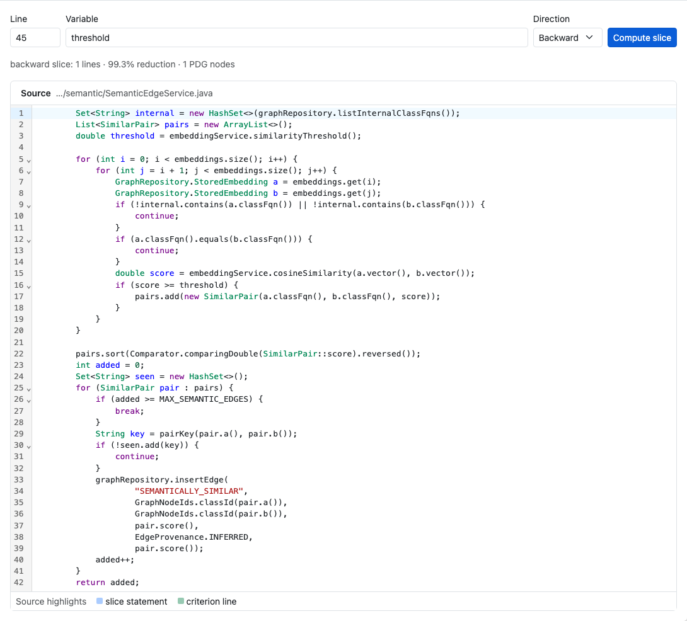
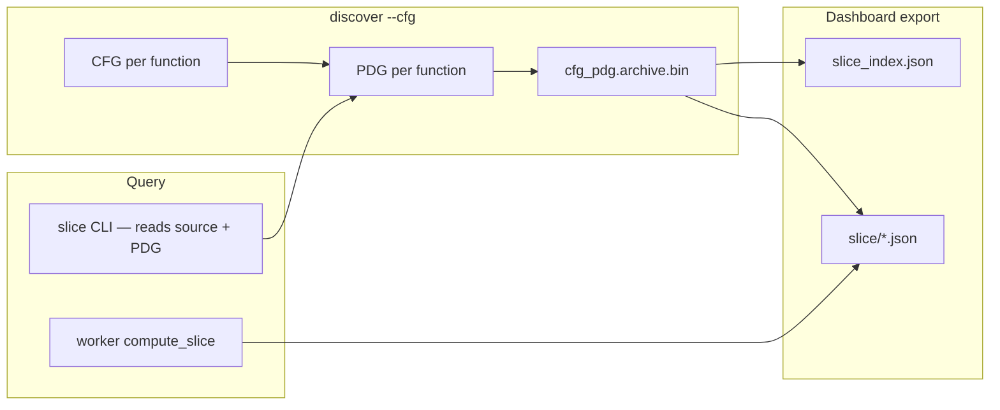

# Program Slicing — Engineering Design

**Backward and forward program slices** over a function’s PDG: the minimal set of statements that affect (or are affected by) a variable at a given source line.



*Figure 1: **Program Slicing** tab — function picker, line/variable/direction inputs, and CodeMirror source view with highlighted slice lines.*

---

## 1. Goals

| Goal | How |
|------|-----|
| Minimal relevant code | PDG traversal from slice criterion |
| CLI automation | `rbuilder slice FILE --line N --variable V` |
| Dashboard exploration | WASM `compute_slice` on exported PDG bundles |
| Security cross-check | `--taint` mode shares taint engine paths |

Requires `discover --cfg` or `--all` for PDG archives and dashboard export.

---

## 2. Architecture overview



---

## 3. Slice criterion

| Field | Role |
|-------|------|
| `file` | Source path (read from disk at CLI; bundled in dashboard) |
| `--line` | 1-based line number |
| `--variable` | Variable name at criterion |
| `--function` | Enclosing **method** name (disambiguation) |
| `--direction` | `backward` (default) or `forward` |

---

## 4. Rust implementation map

| Component | Path |
|-----------|------|
| CFG construction | `crates/rbuilder-analysis/src/cfg.rs` |
| PDG + slicing | `crates/rbuilder-analysis/src/pdg.rs`, `slicing.rs` |
| CLI | `src/cli/slice.rs` |
| Archive storage | `crates/rbuilder-analysis/src/storage.rs` |
| Dashboard export | `crates/rbuilder-dashboard/src/slice_export.rs` |

---

## 5. Dashboard implementation

| Piece | Path |
|-------|------|
| Tab | `dashboard/src/SliceView.tsx` |
| Editor | `dashboard/src/sliceEditor.tsx` (CodeMirror) |
| Worker | `computeSlice(functionId, line, variable, direction)` |
| Index | `slice_index.json` → `slice/{uuid}.json` |

---

## 6. CLI usage

```bash
rbuilder discover . --cfg
rbuilder slice src/Foo.java --line 42 --variable cart --function checkOut
rbuilder -f json slice src/Foo.java --line 10 --variable req --direction forward
rbuilder slice src/Foo.java --line 8 --variable input --taint
```

---

## 7. Testing

| Layer | Location |
|-------|----------|
| Analysis unit tests | `crates/rbuilder-analysis/src/slicing.rs` |
| CLI subprocess | `tests/cli_output/all_commands_sanity.rs` |
| Dashboard harness | `tests/dashboard_harness.rs` (`slice_index.json`) |

Screenshots: `capture-design-screenshots.mjs` → `docs/images/design/program-slicing/`.

---

## 8. Related docs

- [PDG design](pdg-design.md) · [Taint design](taint-analysis-design.md)
- [Analysis architecture](../analysis-architecture.md)
