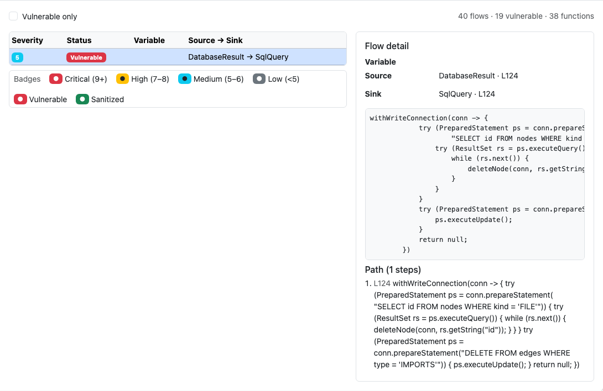
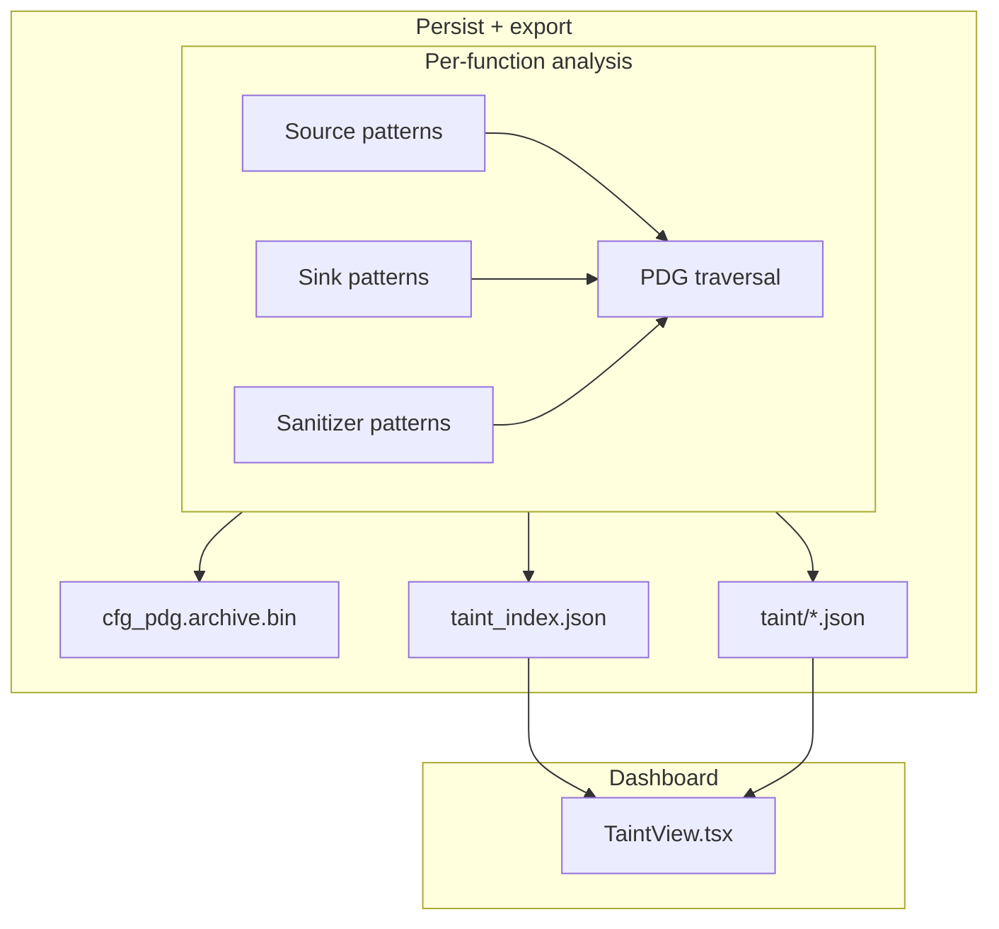

# Taint Analysis — Engineering Design

**Source → sink** dataflow tracking with sanitizer awareness: HTTP parameters, file reads, and other sources flowing into SQL, shell, render, and other sensitive sinks.



*Figure 1: **Taint Analysis** tab — per-function flow list with severity badges and source→sink paths.*

---

## 1. Goals

| Goal | How |
|------|-----|
| Find risky data paths | Intra-procedural taint on CFG/PDG |
| Rank severity | Flow severity score + vulnerable flag |
| Dashboard triage | Function sidebar + flows table |
| CLI verification | `slice --taint` and exported `taint/*.json` |

Enabled by `discover --cfg` / `--all` (language-dependent pattern catalogs).

---

## 2. Architecture overview



---

## 3. Flow model

Each **taint flow** records:

- Source statement / symbol
- Sink statement / symbol  
- Intermediate path (when available)
- **Severity** (0–10) and **vulnerable** boolean (sanitizer not on path)

Dashboard: filter **vulnerable only**; click a flow for path detail.

---

## 4. Rust implementation map

| Component | Path |
|-----------|------|
| Taint engine | `crates/rbuilder-analysis/src/taint.rs` |
| Language sinks/sources | Pattern tables per `rbuilder-lang-*` |
| Storage | `crates/rbuilder-analysis/src/storage.rs` |
| Dashboard export | `crates/rbuilder-dashboard/src/taint_export.rs` |
| CLI taint slice | `src/cli/slice.rs` (`--taint`) |

---

## 5. Dashboard implementation

| Piece | Path |
|-------|------|
| Tab | `dashboard/src/TaintView.tsx` |
| Index | `taint_index.json` (`flow_count`, `vulnerable_count`) |
| Detail bundles | `taint/{function_id}.json` |
| Legends | `viewLegendData.ts` — severity / status badges |

---

## 6. CLI usage

```bash
rbuilder discover . --all
rbuilder slice src/Endpoint.java --line 20 --variable request --function handle --taint
# Inspect exported flows under .rbuilder/analysis/ or dashboard taint/*.json
```

---

## 7. Testing

| Layer | Location |
|-------|----------|
| Language taint fixtures | `tests/*_taint.rs` |
| Dashboard harness | `tests/dashboard_harness.rs` (`taint_index.json`) |

Screenshots: `capture-design-screenshots.mjs` → `docs/images/design/taint-analysis/`.

---

## 8. Related docs

- [PDG design](pdg-design.md) · [Program slicing design](program-slicing-design.md)
- [Analysis architecture](../analysis-architecture.md)
