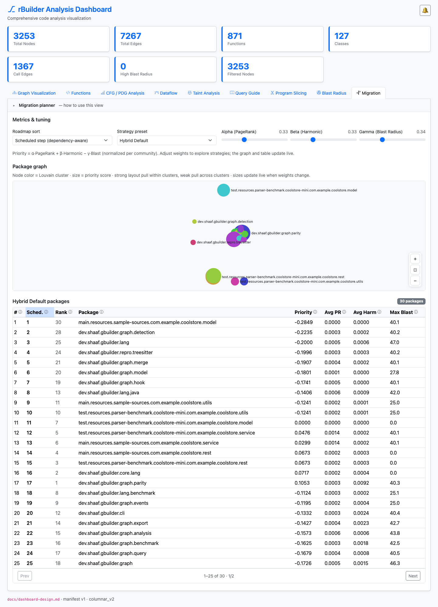
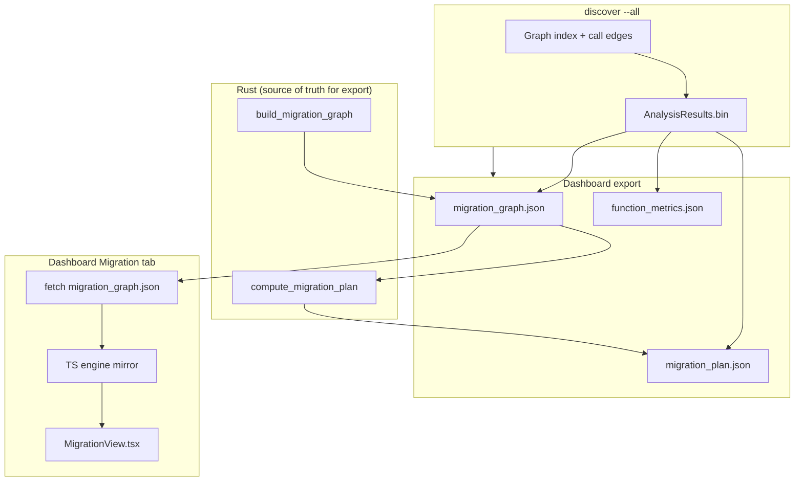
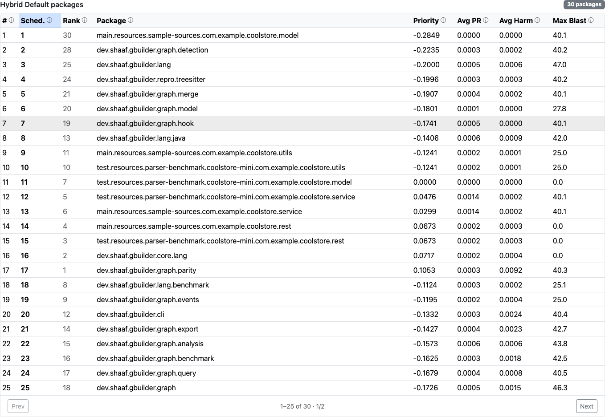
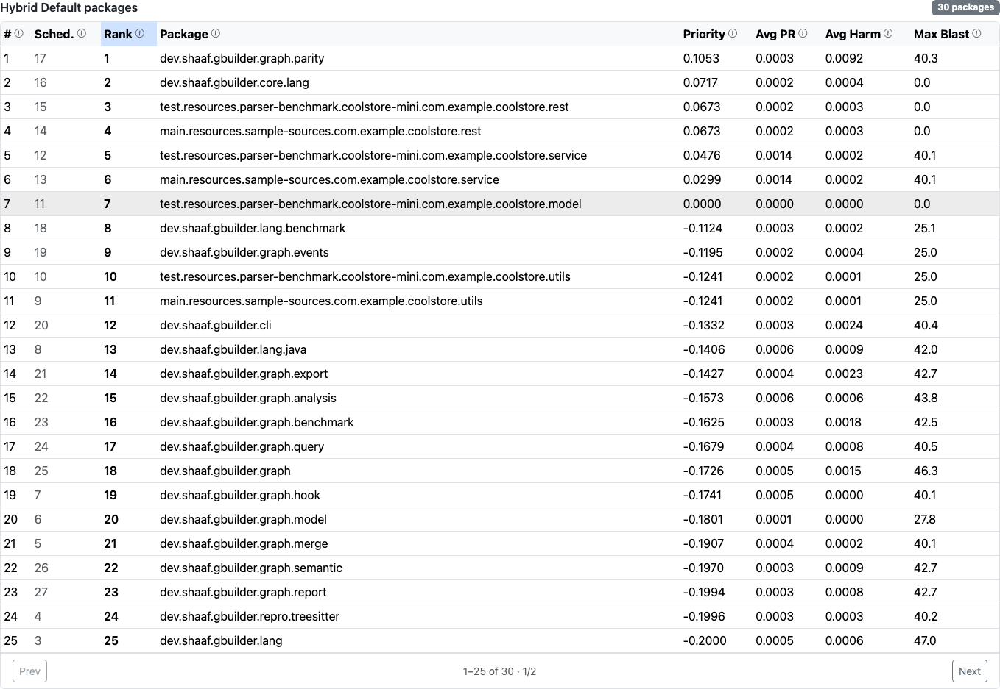
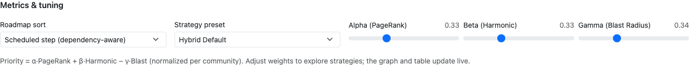
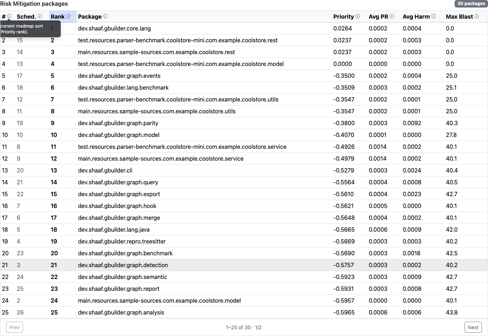
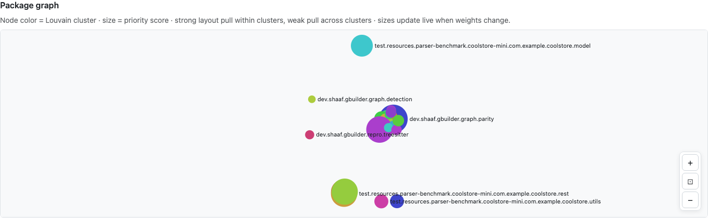
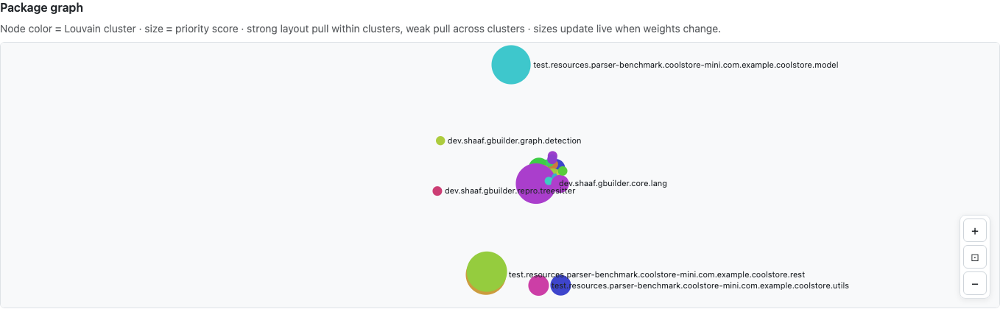

# Migration Planner — Engineering Design

This document describes the **Software Migration & Blast Radius Planner** as implemented in rBuilder: data flow, algorithms, file formats, dashboard behavior, CLI, tests, and extension points.

---

## 1. Goals

The migration planner helps teams produce a **step-by-step extraction roadmap** for breaking apart a monolith (or large codebase) into migratable units. It combines:

| Input | Role |
|-------|------|
| **PageRank** | Architectural importance / centrality |
| **Harmonic centrality** | Reachability / “closeness” in the call graph |
| **Blast radius** | Downstream impact risk if a node changes |
| **Call-graph dependencies** | Ordering constraints (callees before callers) |

Users can tune a **multi-objective score** with presets or custom α/β/γ weights, compare **dependency-aware schedule** vs **pure priority rank**, and explore results interactively in the dashboard or export JSON for CI.



*Figure 1: Unified Migration view on the gbuilder repo — metrics & tuning, package graph, and paginated packages table on one scrollable page.*

---

## 2. Architecture overview



**Dual implementation:** The scoring, topological schedule, and priority rank are implemented in **Rust** (CLI + default plan export) and **mirrored in TypeScript** (live dashboard recalculation when sliders change). Keep them in sync when changing algorithms.

---

## 3. Macro graph: package-level nodes

### 3.1 Why packages, not raw communities?

Early versions grouped by **label-propagation community id** (~300+ nodes on large repos, labels like `Community 2412`). The current design uses **package/module macro nodes** aligned with the dashboard metagraph:

- **Readable labels** (`com.example.orders`, `dev.foo.graph.detection`)
- **Bounded size** — cap at 256 nodes; overflow merges into `(other)`
- **Same call-aggregation model** as the Graph tab metagraph

Exported as `migration_graph.json` with `"mode": "package_macro"`.



*Figure 2: Package-level roadmap rows (`dev.shaaf.gbuilder.*`) instead of anonymous community ids. Pagination shows 25 rows per page.*

### 3.2 Package label derivation

Implemented in `crates/rbuilder-analysis/src/migration.rs` as `package_label(file_path)` (same rules as `crates/rbuilder-dashboard/src/metagraph.rs`):

| Path pattern | Example | Label |
|--------------|---------|-------|
| Contains `/java/` | `src/main/java/com/foo/Bar.java` | `com.foo` |
| Contains `/src/` | `src/graph/detection/mod.rs` | `src.graph.detection` |
| Fallback | `lib/util/helper.c` | parent dir with `/` → `.` |
| No path | — | `root` |

**Language notes:**

- **Java** — closest to real package semantics.
- **Rust** — crate-relative **module directory**, not Cargo crate name.
- **C/C++** — directory-based grouping, not Makefile targets or link units.

### 3.3 Aggregation per package

For each `Function` node in the memory backend:

1. Resolve `compact_id` → metrics from `AnalysisResults`
2. Bucket by `package_label(file_path)`
3. Accumulate:
   - `member_count`
   - sums of PageRank, harmonic, betweenness → **averages**
   - **max** blast radius across members
   - **Louvain votes** — count of each label-propagation community id among members

After ranking buckets by `member_count` (descending):

- Top **255** become individual macro nodes (ids `0..n-1`)
- Remainder merge into **`(other)`**

### 3.4 Inter-package edges

Scan `Calls` edges. For each call where caller and callee map to **different** packages:

- Aggregate weight = call count
- Direction: **`source` = caller package**, **`target` = callee package**

Intra-package calls are omitted from the macro graph (they do not create macro edges).

### 3.5 Louvain community id on macro nodes

Field: `louvain_community_id: Option<usize>` — **majority vote** of member functions’ label-propagation ids.

Used for:

- **Graph node color** in the dashboard (cluster visually)
- **ForceAtlas2 layout edge weighting** (intra- vs inter-cluster pull)

Community detection itself lives in `crates/rbuilder-analysis/src/community.rs` (**label propagation** with modularity scoring, not Louvain library — despite historical naming in comments).

---

## 4. Scoring algorithm

### 4.1 Formula

For each macro node (package) `p`:

```
Priority(p) = α · norm(avg_pagerank_p)
            + β · norm(avg_harmonic_p)
            − γ · norm(max_blast_p)
```

- **Normalization:** min–max across all macro nodes in the graph; if all equal → `0.5` for each.
- **Betweenness** is aggregated (`avg_betweenness`) and exported but **not** in the scoring formula today.

Default weights (`MigrationWeights::hybrid_default`): α=0.33, β=0.33, γ=0.34.

### 4.2 Presets

| Preset id | Label | α | β | γ | Intent |
|-----------|-------|---|---|---|--------|
| `hybrid_default` | Hybrid Default | 0.33 | 0.33 | 0.34 | Balanced |
| `foundational_first` | Foundational First | 0.60 | 0.30 | 0.10 | Favor high centrality |
| `dense_cluster` | Dense Cluster Extraction | 0.20 | 0.50 | 0.30 | Favor harmonic / reachability |
| `risk_mitigation` | Risk Mitigation | 0.10 | 0.20 | 0.70 | Penalize blast radius heavily |

Custom slider values set preset to **`custom`** when no preset matches (tolerance 0.001 per weight).

---

## 5. Ordering algorithms

Every plan step carries **both** rank columns; the active sort mode only affects display row `#` and export order.

### 5.1 Priority rank (`priority_rank`)

Pure sort by **priority score descending**. Tie-break: **lowest macro node id**.

```
priority_rank = 1  → highest score migrates first (ignoring dependencies)
```

### 5.2 Scheduled step (`schedule_step`) — Kahn topological sort

**Dependency rule:** If package A calls package B, **B must be scheduled before A** (migrate callees before callers).

Construction from call edges `(caller → callee)`:

- Scheduling edge: `callee → caller`
- **Kahn’s algorithm** with a ready set ordered by **highest priority score**, tie-break lowest id
- **Cycle fallback:** any nodes left after Kahn (SCC/cycles) appended in priority-score order

Rust uses a `BinaryHeap` for the ready queue; TypeScript sorts the ready array each step — same semantics.

### 5.3 Order modes

| Mode | `steps` array sort | `#` column |
|------|-------------------|------------|
| `scheduled` (default) | by `schedule_step` | dependency-aware row |
| `priority` | by `priority_rank` | score-only row |

CLI: `--migration-order scheduled|priority`  
Dashboard: **Roadmap sort** dropdown in Metrics & tuning.


*Figure 3a: **Scheduled step** mode — `#` follows dependency-aware `schedule_step` (highlighted column).*



*Figure 3b: **Priority rank** mode — `#` follows pure score order (`priority_rank` highlighted). Both columns remain visible for comparison.*

---

## 6. JSON schemas

### 6.1 `migration_graph.json` (schema v2)

Written to `.rbuilder/dashboard/migration_graph.json` on discover.

```json
{
  "schema_version": 2,
  "mode": "package_macro",
  "modularity": 0.51,
  "communities": [
    {
      "id": 0,
      "label": "com.example.foo",
      "member_count": 42,
      "avg_pagerank": 0.0012,
      "avg_harmonic": 0.0034,
      "avg_betweenness": 0.0,
      "max_blast": 47.0,
      "louvain_community_id": 128
    }
  ],
  "edges": [
    { "source": 1, "target": 0, "weight": 5, "kind": "calls" }
  ]
}
```

Note: field name `communities` is historical — entries are **macro packages**.

### 6.2 `migration_plan.json` (schema v2)

Default export on discover uses `hybrid_default` + `scheduled`. CLI can override.

```json
{
  "schema_version": 2,
  "preset": "hybrid_default",
  "preset_label": "Hybrid Default",
  "weights": { "alpha": 0.33, "beta": 0.33, "gamma": 0.34 },
  "order_mode": "scheduled",
  "steps": [
    {
      "step": 1,
      "community_id": 0,
      "label": "com.example.foo",
      "priority_score": -0.24,
      "schedule_step": 1,
      "priority_rank": 12,
      "avg_pagerank": 0.001,
      "avg_harmonic": 0.002,
      "max_blast": 40.1
    }
  ]
}
```

### 6.3 `function_metrics.json` (schema v2)

Per-function metrics for the **Functions** tab (not consumed directly by Migration UI):

- `pagerank`, `harmonic`, `betweenness`, `blast`, `community_id`

Migration uses pre-aggregated package metrics in `migration_graph.json`.

---

## 7. Rust implementation map

| Component | Path |
|-----------|------|
| Graph build + plan compute | `crates/rbuilder-analysis/src/migration.rs` |
| Public exports | `crates/rbuilder-analysis/src/lib.rs` |
| Dashboard bundle write | `crates/rbuilder-dashboard/src/migration_export.rs` |
| Discover integration | `crates/rbuilder-dashboard/src/lib.rs` → `export_dashboard_bundle` |
| CLI flags | `src/cli/mod.rs`, `src/cli/discover.rs`, `src/cli/discover_impl.rs` |
| Manifest fields | `crates/rbuilder-dashboard/src/manifest.rs` (`migration_available`, paths) |

Key functions:

- `build_migration_graph(backend, results) -> Option<MigrationGraphPayload>`
- `compute_migration_plan(graph, preset, weights, order_mode) -> MigrationPlanPayload`
- `package_label(&str) -> String`
- `export_migration_graph` / `export_default_migration_plan` / `write_migration_plan_from_repo`

Constants:

- `MIGRATION_GRAPH_SCHEMA_VERSION = 2`
- `MIGRATION_PLAN_SCHEMA_VERSION = 2`
- `MAX_MIGRATION_MACRO_NODES = 256`

---

## 8. Dashboard implementation

### 8.1 Entry point

- Tab: **Migration** in `dashboard/src/App.tsx`
- View: `dashboard/src/MigrationView.tsx`
- Data: `fetch(bundleDataUrl("migration_graph.json"))` — plan is **recomputed client-side**

### 8.2 Unified layout (single scrollable page)

Top → bottom:

1. **Metrics & tuning** — roadmap sort, preset, α/β/γ sliders
2. **Package graph** — Sigma.js + ForceAtlas2
3. **Packages table** — paginated (25 rows/page), column tooltips



*Figure 4: Roadmap sort, strategy preset, and α/β/γ weight sliders. Changes recalculate the plan and graph live in the browser.*



*Figure 5: Per-column help tooltips on the packages table (info icon on headers).*

### 8.3 TypeScript engine (mirror of Rust)

| Module | Responsibility |
|--------|----------------|
| `dashboard/src/migration/scoring.ts` | normalize + priority score |
| `dashboard/src/migration/topologicalSort.ts` | Kahn schedule |
| `dashboard/src/migration/priorityRank.ts` | score-only ordering |
| `dashboard/src/migration/engine.ts` | `computeMigrationPlan` orchestration |
| `dashboard/src/migration/presets.ts` | preset definitions + `matchPreset` |
| `dashboard/src/migration/types.ts` | JSON TypeScript types |
| `dashboard/src/migration/layoutWeights.ts` | graph layout edge weights |

### 8.4 Graph visualization

- **Library:** Sigma.js + graphology; layout via `layoutForceAtlas2` in `dashboard/src/graphLayout.ts`
- **Node size:** priority score (min–max mapped to 4–28px)
- **Node color:** `louvain_community_id` (fallback: macro id)
- **Edge layout weights:**
  - Same Louvain cluster: `call_weight × 4.0`
  - Different cluster: `call_weight × 0.35`
  - Hidden chain edges between same-cluster packages without direct calls (`layout:*` keys, not rendered)
- **Live updates:** node sizes refresh on debounced slider changes (200 ms); full graph remount when `migration_graph.json` changes
- **`edgeWeightInfluence: 1`** enabled in ForceAtlas2 settings



*Figure 6: Package graph — node color = Louvain cluster, node size = priority score.*



*Figure 7: Graph node sizes update when preset/weights change (Risk Mitigation de-emphasizes high-blast packages).*

---

## 9. CLI usage

```bash
# Full analysis + dashboard bundle (includes migration_graph.json + default plan)
rbuilder discover . --all

# Export plan to file
rbuilder discover . --export-migration-plan \
  --migration-preset risk_mitigation \
  --migration-order priority \
  -o migration_plan.json

# JSON to stdout (with discover JSON envelope)
rbuilder discover . --export-migration-plan -f json

# Serve dashboard
rbuilder serve -r /path/to/repo --open
```

Flags:

| Flag | Default | Description |
|------|---------|-------------|
| `--export-migration-plan` | off | Write plan JSON |
| `--migration-preset` | `hybrid_default` | Strategy preset |
| `--migration-order` | `scheduled` | `scheduled` or `priority` |
| `-o` | `.rbuilder/migration_plan.json` | Output path |

---

## 10. Testing

| Layer | Location | What it checks |
|-------|----------|----------------|
| Rust unit | `crates/rbuilder-analysis/src/migration.rs` (`mod tests`) | package labels, aggregation, Kahn order, dual rank, tie-break, presets |
| Vitest | `dashboard/src/migration/engine.test.ts` | scoring, schedule vs priority, preset matching |
| CLI integration | `tests/migration_plan_cli.rs` | export file, stdout JSON, presets, `--migration-order` |
| Dashboard harness | `tests/dashboard_harness.rs` | `migration_graph.json` + plan schema v2 fields on discover |
| Playwright | `dashboard/scripts/test-migration.mjs`, `test-migration-gbuilder.mjs` | unified UI, graph canvas, preset reactivity, pagination |
| Doc screenshots | `dashboard/scripts/capture-migration-screenshots.mjs` | PNGs under `docs/images/migration-planner/` |

Run locally:

```bash
cargo test -p rbuilder-analysis migration::
cargo test --test migration_plan_cli
cd dashboard && npm run test:unit
DASHBOARD_URL=http://127.0.0.1:8080/ node dashboard/scripts/test-migration-gbuilder.mjs

# Regenerate design-doc screenshots (serve target repo first)
DASHBOARD_URL=http://127.0.0.1:8080/ node dashboard/scripts/capture-migration-screenshots.mjs
```

After dashboard UI changes:

```bash
cd dashboard && npm run build
cargo build --release   # embeds dashboard/dist
rbuilder discover . --all   # refresh .rbuilder/dashboard static JSON
```

---

## 11. Extension guide

### 11.1 Add a new metric to the score

1. Ensure metric exists per-function in `AnalysisResults` and/or `function_metrics_export.rs`
2. Aggregate into `MigrationCommunityNode` in `build_migration_graph`
3. Add field to JSON schema (bump `schema_version` if breaking)
4. Extend `communityPriorityScores` / Rust `compute_migration_plan` normalization
5. Add table column + tooltip in `MigrationView.tsx`
6. Update TS types and both test suites

### 11.2 Change macro grouping (e.g. Cargo crate, CMake target)

Replace or augment `package_label()` bucketing in `build_migration_graph`. Reuse metagraph logic if the grouping should match another tab.

Consider bumping `mode` string (e.g. `cargo_crate`) for forward compatibility.

### 11.3 Add a preset

1. `MigrationWeights::from_preset` + `preset_label` in Rust
2. `MIGRATION_PRESETS` in `dashboard/src/migration/presets.ts`
3. CLI `value_parser` list in `src/cli/mod.rs`
4. Document in this file §4.2

### 11.4 New sort mode

1. Extend `MigrationOrderMode` enum (Rust + TS)
2. Compute new rank column on each step (or derive from existing)
3. Wire CLI + dashboard dropdown + `sort_steps` / `sortSteps`

### 11.5 Keep Rust and TS in sync

Any change to normalization, edge direction for scheduling, or tie-breaking **must** be applied in:

- `crates/rbuilder-analysis/src/migration.rs`
- `dashboard/src/migration/*.ts`

Add paired unit tests with the same fixture expectations.

---

## 12. Known limitations

| Topic | Current behavior |
|-------|------------------|
| Betweenness | Exported, not in score |
| Intra-package calls | Not shown as macro edges |
| C/Rust “package” | Directory/module path, not build-system unit |
| Cycles in call graph | Scheduled via fallback (not true SCC-aware planner) |
| Plan on disk | Default export only; dashboard always recalculates from graph + UI state |
| Very large repos | Capped at 256 macro nodes + `(other)` bucket |

---

## 13. File checklist (quick reference)

```
crates/rbuilder-analysis/src/migration.rs     # core algorithms
crates/rbuilder-dashboard/src/migration_export.rs
dashboard/src/MigrationView.tsx               # UI
dashboard/src/migration/                        # TS engine
dashboard/scripts/capture-migration-screenshots.mjs
docs/images/migration-planner/                  # design doc screenshots
tests/migration_plan_cli.rs
docs/migration-algorithms.md                    # background
docs/building-migration-plan.md                 # workflow guide
```

---

## 14. Example end-to-end (gbuilder)

```bash
cargo build --release
rbuilder -r ~/git/java/gbuilder discover . --all
# → migration_graph.json: ~30 packages, mode package_macro
rbuilder serve -r ~/git/java/gbuilder
# Migration tab → tune presets → inspect package graph + paginated table
```

Typical gbuilder labels: `dev.shaaf.gbuilder.graph`, `dev.shaaf.gbuilder.lang.java`, etc.

Screenshots in this document were captured from gbuilder at 1440×900 via Playwright (see §10).
