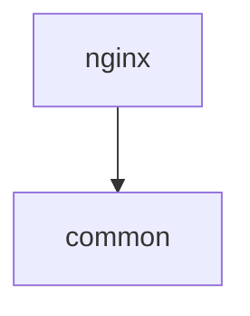

# Test Script 03: Module Dependencies

**Test ID**: UAT-PUPPET-03  
**Duration**: 15 minutes  
**Difficulty**: Medium  
**Prerequisites**: Scripts 01 and 02 passed

---

## Objective

Validate module dependency graph construction, topological sorting, and circular dependency detection.

---

## Test Steps

### Step 1: Analyze Module Dependencies (Filesystem)

**Action**: Scan modules directory without using indexed graph

```bash
cd ~/git/rust/rBuilder

# Analyze from filesystem
./target/release/rbuilder puppet modules tests/fixtures/puppet/modules --show-deps
```

**Expected Output**:
```
Puppet Modules: 2
Module: nginx (v1.0.0)
  Path: tests/fixtures/puppet/modules/nginx
  Dependencies:
    - common

Module: common (v1.0.0)
  Path: tests/fixtures/puppet/modules/common

Dependency order:
  1. common
  2. nginx
```

**Pass Criteria**:
- ✅ Both modules detected
- ✅ nginx depends on common
- ✅ Dependency order is correct (common before nginx)

**Fail Criteria**:
- ❌ Modules missing
- ❌ Wrong dependency order
- ❌ Dependencies not shown

**What's Being Tested**: Filesystem-based module analysis and topological sort

---

### Step 2: Analyze from Indexed Graph

**Action**: Use the already-indexed graph (from Script 02)

```bash
# Use --from-graph flag
./target/release/rbuilder puppet modules tests/fixtures/puppet/modules \
  --show-deps --from-graph
```

**Expected Output**:
```
Puppet Modules: 2
Module: nginx (v1.0.0)
  Dependencies:
    - common

Module: common (v1.0.0)

Dependency order:
  1. common
  2. nginx
```

**Pass Criteria**:
- ✅ Output matches filesystem scan
- ✅ Graph query is faster than filesystem scan

**Fail Criteria**:
- ❌ Different results from filesystem scan
- ❌ Missing modules or dependencies

**What's Being Tested**: Graph-based dependency analysis

---

### Step 3: Test JSON Output Format

**Action**: Get dependency graph as JSON

```bash
./target/release/rbuilder puppet modules tests/fixtures/puppet/modules \
  --format json > /tmp/puppet_modules.json

# Pretty-print with jq (if available)
cat /tmp/puppet_modules.json | jq '.'
```

**Expected Output**:
```json
{
  "common": {
    "name": "common",
    "version": "1.0.0",
    "path": "tests/fixtures/puppet/modules/common",
    "dependencies": [],
    "dependents": ["nginx"]
  },
  "nginx": {
    "name": "nginx",
    "version": "1.0.0",
    "path": "tests/fixtures/puppet/modules/nginx",
    "dependencies": ["common"],
    "dependents": []
  }
}
```

**Pass Criteria**:
- ✅ Valid JSON output
- ✅ All modules present
- ✅ Dependencies and dependents arrays correct

**Fail Criteria**:
- ❌ Invalid JSON
- ❌ Missing fields
- ❌ Empty output

**What's Being Tested**: JSON serialization

---

### Step 4: Test Mermaid Diagram Output

**Action**: Generate dependency graph as Mermaid diagram

```bash
./target/release/rbuilder puppet modules tests/fixtures/puppet/modules \
  --format mermaid
```

**Expected Output**:


**Pass Criteria**:
- ✅ Valid Mermaid syntax
- ✅ Dependency arrow points from nginx to common
- ✅ Can be rendered in Mermaid viewer

**Fail Criteria**:
- ❌ Invalid syntax
- ❌ Wrong direction
- ❌ Missing nodes

**What's Being Tested**: Graph visualization export

---

### Step 5: Test Circular Dependency Detection

**Action**: Create modules with circular dependency

```bash
# Create test modules with circular deps
mkdir -p /tmp/puppet-circular/modules/{mod_a,mod_b}

# Module A depends on B
cat > /tmp/puppet-circular/modules/mod_a/metadata.json <<'EOF'
{
  "name": "mod_a",
  "version": "1.0.0",
  "dependencies": [
    {"name": "mod_b"}
  ]
}
EOF

# Module B depends on A (circular!)
cat > /tmp/puppet-circular/modules/mod_b/metadata.json <<'EOF'
{
  "name": "mod_b",
  "version": "1.0.0",
  "dependencies": [
    {"name": "mod_a"}
  ]
}
EOF

# Try to analyze (should detect cycle)
./target/release/rbuilder puppet modules /tmp/puppet-circular/modules 2>&1
```

**Expected Output**:
```
Puppet Modules: 2
Module: mod_a (v1.0.0)
  Dependencies:
    - mod_b

Module: mod_b (v1.0.0)
  Dependencies:
    - mod_a

Error: Circular dependency detected in Puppet modules
```

**Pass Criteria**:
- ✅ Circular dependency detected
- ✅ Error message is clear
- ✅ Both modules are listed

**Fail Criteria**:
- ❌ Cycle not detected
- ❌ Infinite loop or hang
- ❌ Unclear error

**What's Being Tested**: Cycle detection in dependency graph

---

### Step 6: Test Complex Dependency Tree

**Action**: Create a larger dependency tree

```bash
# Create 4 modules: A → B → C, A → D
mkdir -p /tmp/puppet-complex/modules/{a,b,c,d}

cat > /tmp/puppet-complex/modules/a/metadata.json <<'EOF'
{"name": "a", "version": "1.0.0", "dependencies": [{"name": "b"}, {"name": "d"}]}
EOF

cat > /tmp/puppet-complex/modules/b/metadata.json <<'EOF'
{"name": "b", "version": "1.0.0", "dependencies": [{"name": "c"}]}
EOF

cat > /tmp/puppet-complex/modules/c/metadata.json <<'EOF'
{"name": "c", "version": "1.0.0", "dependencies": []}
EOF

cat > /tmp/puppet-complex/modules/d/metadata.json <<'EOF'
{"name": "d", "version": "1.0.0", "dependencies": []}
EOF

# Analyze
./target/release/rbuilder puppet modules /tmp/puppet-complex/modules --show-deps
```

**Expected Output**:
```
Puppet Modules: 4
...
Dependency order:
  1. c
  2. d
  3. b
  4. a
```

**Pass Criteria**:
- ✅ All 4 modules found
- ✅ Topological order is valid (dependencies before dependents)
- ✅ c and d come before b
- ✅ b comes before a

**Fail Criteria**:
- ❌ Wrong order
- ❌ Missing modules
- ❌ Invalid sort

**What's Being Tested**: Complex graph topological sorting

---

### Step 7: Test Vendor-Prefixed Dependencies

**Action**: Test that vendor prefixes are normalized

```bash
# Create module with vendor-prefixed dependency
mkdir -p /tmp/puppet-vendor/modules/myapp

cat > /tmp/puppet-vendor/modules/myapp/metadata.json <<'EOF'
{
  "name": "myapp",
  "version": "1.0.0",
  "dependencies": [
    {"name": "puppetlabs-stdlib"},
    {"name": "puppetlabs-apache"}
  ]
}
EOF

# Analyze
./target/release/rbuilder puppet modules /tmp/puppet-vendor/modules --show-deps
```

**Expected Output**:
```
Module: myapp (v1.0.0)
  Dependencies:
    - stdlib
    - apache
```

**Pass Criteria**:
- ✅ Vendor prefix stripped ("puppetlabs-stdlib" → "stdlib")
- ✅ Dependencies listed correctly

**Fail Criteria**:
- ❌ Full vendor name kept
- ❌ Dependencies not normalized

**What's Being Tested**: Dependency name normalization

---

### Step 8: Performance Test

**Action**: Measure time to analyze dependency graph

```bash
# Time the analysis
time ./target/release/rbuilder puppet modules tests/fixtures/puppet/modules \
  --show-deps > /dev/null
```

**Expected Output**:
```
real    0m0.050s
user    0m0.030s
sys     0m0.015s
```

**Pass Criteria**:
- ✅ Completes in < 100ms for 2 modules
- ✅ No errors

**Fail Criteria**:
- ❌ Takes > 1 second
- ❌ Errors occur

**What's Being Tested**: Analysis performance

---

## Test Summary

### Dependency Graph Validation

| Test Case | Expected Result | Actual Result | Status |
|-----------|-----------------|---------------|--------|
| Simple deps (nginx→common) | Correct order | | ⬜ |
| JSON format | Valid JSON | | ⬜ |
| Mermaid format | Valid diagram | | ⬜ |
| Circular detection | Error raised | | ⬜ |
| Complex tree (4 modules) | Valid sort | | ⬜ |
| Vendor prefix | Normalized | | ⬜ |

### Checklist

- [ ] Step 1: Filesystem analysis works
- [ ] Step 2: Graph-based analysis matches filesystem
- [ ] Step 3: JSON output is valid
- [ ] Step 4: Mermaid diagram is correct
- [ ] Step 5: Circular deps detected
- [ ] Step 6: Complex tree sorted correctly
- [ ] Step 7: Vendor prefixes normalized
- [ ] Step 8: Performance is acceptable

### Result

**Overall Status**: ⬜ Not Run / ✅ Pass / ❌ Fail

**Accuracy Score**: _____ / 8 steps passed

**Notes**:
```
[Record any observations]
```

### Performance Metrics

| Operation | Time | Target | Status |
|-----------|------|--------|--------|
| Analyze 2 modules | | < 100ms | ⬜ |
| Analyze 4 modules | | < 200ms | ⬜ |
| Detect circular dep | | < 100ms | ⬜ |

### Issues Found

| Step | Issue | Severity |
|------|-------|----------|
| - | - | - |

### Next Steps

If all checks pass: ✅ **Proceed to Script 04 (Security Scanning)**

If any check fails:
1. Check that metadata.json files are valid JSON
2. Verify topological sort algorithm
3. Review circular dependency detection
4. Re-run failed steps

---

**Test Executed By**: _______________  
**Date**: _______________  
**Signature**: _______________
