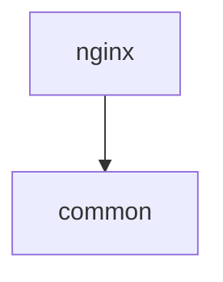

# Test Script 06: CLI Commands

**Test ID**: UAT-PUPPET-06  
**Duration**: 10 minutes  
**Difficulty**: Easy  
**Prerequisites**: Scripts 01 and 02 passed

---

## Objective

Validate all Puppet CLI commands work correctly with proper flags, error handling, and output formats.

---

## Test Steps

### Step 1: Test `puppet modules` Command

**Action**: Run modules command with default options

```bash
cd ~/git/rust/rBuilder

./target/release/rbuilder puppet modules tests/fixtures/puppet/modules
```

**Expected Output**:
```
Puppet Modules: 2
Module: nginx (v1.0.0)
  Path: tests/fixtures/puppet/modules/nginx
Module: common (v1.0.0)
  Path: tests/fixtures/puppet/modules/common
Dependency order:
  1. common
  2. nginx
```

**Pass Criteria**:
- ✅ Both modules listed
- ✅ Versions shown
- ✅ Paths displayed
- ✅ Dependency order correct

**Fail Criteria**:
- ❌ Command fails
- ❌ Modules missing
- ❌ No output

**What's Being Tested**: Basic modules command

---

### Step 2: Test `--show-deps` Flag

**Action**: Show detailed dependencies

```bash
./target/release/rbuilder puppet modules tests/fixtures/puppet/modules --show-deps
```

**Expected Output**:
```
Module: nginx (v1.0.0)
  Path: tests/fixtures/puppet/modules/nginx
  Dependencies:
    - common

Module: common (v1.0.0)
  Path: tests/fixtures/puppet/modules/common
```

**Pass Criteria**:
- ✅ Dependencies section appears
- ✅ nginx shows common as dependency
- ✅ common shows no dependencies

**Fail Criteria**:
- ❌ Dependencies not shown
- ❌ Wrong dependencies

**What's Being Tested**: Dependency listing

---

### Step 3: Test `--format json` Flag

**Action**: Output as JSON

```bash
./target/release/rbuilder puppet modules tests/fixtures/puppet/modules --format json | jq '.' > /tmp/modules.json
```

**Expected Output**:
```json
{
  "common": {
    "name": "common",
    "version": "1.0.0",
    "path": "tests/fixtures/puppet/modules/common",
    "dependencies": [],
    "dependents": ["nginx"]
  },
  "nginx": {
    "name": "nginx",
    "version": "1.0.0",
    "path": "tests/fixtures/puppet/modules/nginx",
    "dependencies": ["common"],
    "dependents": []
  }
}
```

**Pass Criteria**:
- ✅ Valid JSON (jq parses it)
- ✅ All fields present
- ✅ Data is accurate

**Fail Criteria**:
- ❌ Invalid JSON
- ❌ Missing fields
- ❌ Empty output

**What's Being Tested**: JSON output format

---

### Step 4: Test `--format mermaid` Flag

**Action**: Output as Mermaid diagram

```bash
./target/release/rbuilder puppet modules tests/fixtures/puppet/modules --format mermaid
```

**Expected Output**:


**Pass Criteria**:
- ✅ Valid Mermaid syntax
- ✅ Dependency arrow present
- ✅ Node names correct

**Fail Criteria**:
- ❌ Invalid syntax
- ❌ Wrong direction
- ❌ Missing nodes

**What's Being Tested**: Mermaid diagram generation

---

### Step 5: Test `--from-graph` Flag

**Action**: Use indexed graph instead of filesystem

```bash
# Ensure graph exists
./target/release/rbuilder init tests/fixtures/puppet > /dev/null 2>&1

# Query from graph
./target/release/rbuilder puppet modules tests/fixtures/puppet/modules --from-graph
```

**Expected Output**:
```
Puppet Modules: 2
Module: nginx (v1.0.0)
...
```

**Pass Criteria**:
- ✅ Output matches filesystem scan
- ✅ No errors

**Fail Criteria**:
- ❌ Different results
- ❌ Graph not found error

**What's Being Tested**: Graph-based analysis flag

---

### Step 6: Test `puppet validate` Command

**Action**: Validate a single manifest

```bash
./target/release/rbuilder puppet validate tests/fixtures/puppet/modules/nginx/manifests/init.pp
```

**Expected Output**:
```
Valid Puppet manifest: 1 class symbol(s)
```

**Pass Criteria**:
- ✅ Validation succeeds
- ✅ Symbol count shown
- ✅ Exit code 0

**Fail Criteria**:
- ❌ Validation fails
- ❌ No output

**What's Being Tested**: Manifest validation

---

### Step 7: Test Validate on Directory

**Action**: Validate all manifests in a directory

```bash
./target/release/rbuilder puppet validate tests/fixtures/puppet/modules/nginx/
```

**Expected Output**:
```
tests/fixtures/puppet/modules/nginx/manifests/init.pp: 5 symbol(s)
tests/fixtures/puppet/modules/nginx/manifests/server.pp: 3 symbol(s)
```

**Pass Criteria**:
- ✅ All manifest files listed
- ✅ Symbol counts for each
- ✅ No errors

**Fail Criteria**:
- ❌ Files missing
- ❌ Validation fails

**What's Being Tested**: Batch validation

---

### Step 8: Test `puppet security-scan` Command

**Action**: Run security scan

```bash
./target/release/rbuilder puppet security-scan tests/fixtures/puppet/modules/nginx
```

**Expected Output**:
```
[Critical] Potential command injection...
[High] Potential hardcoded secret...
[Medium] Insecure file permissions...
```

**Pass Criteria**:
- ✅ Findings reported
- ✅ Severity levels shown
- ✅ CWE identifiers included

**Fail Criteria**:
- ❌ No findings (should find 3)
- ❌ Command crashes

**What's Being Tested**: Security scan command

---

### Step 9: Test Security Scan with Filtering

**Action**: Use --min-severity flag

```bash
./target/release/rbuilder puppet security-scan tests/fixtures/puppet/modules/nginx \
  --min-severity critical
```

**Expected Output**:
```
[Critical] Potential command injection in exec resource...
```

**Pass Criteria**:
- ✅ Only critical findings shown
- ✅ High and medium filtered out

**Fail Criteria**:
- ❌ All findings shown
- ❌ No filtering

**What's Being Tested**: Severity filtering in CLI

---

### Step 10: Test Security Scan JSON Output

**Action**: Get scan results as JSON

```bash
./target/release/rbuilder puppet security-scan tests/fixtures/puppet/modules/nginx \
  --format json | jq '.[].cwe'
```

**Expected Output**:
```
"CWE-78"
"CWE-798"
"CWE-732"
```

**Pass Criteria**:
- ✅ Valid JSON
- ✅ All 3 CWE identifiers present

**Fail Criteria**:
- ❌ Invalid JSON
- ❌ Missing CWEs

**What's Being Tested**: JSON output for security findings

---

### Step 11: Test Error Handling - Invalid Path

**Action**: Try to analyze non-existent path

```bash
./target/release/rbuilder puppet modules /nonexistent/path 2>&1
```

**Expected Output**:
```
Error: No such file or directory (os error 2)
```

**Pass Criteria**:
- ✅ Clear error message
- ✅ Non-zero exit code
- ✅ No crash/panic

**Fail Criteria**:
- ❌ Unclear error
- ❌ Panic/crash

**What's Being Tested**: Error handling for invalid input

---

### Step 12: Test Help Text

**Action**: View help for each command

```bash
# Main puppet help
./target/release/rbuilder puppet --help

# Modules subcommand help
./target/release/rbuilder puppet modules --help

# Validate subcommand help
./target/release/rbuilder puppet validate --help

# Security-scan subcommand help
./target/release/rbuilder puppet security-scan --help
```

**Pass Criteria**:
- ✅ All help texts display
- ✅ Flags documented
- ✅ Examples provided
- ✅ Descriptions clear

**Fail Criteria**:
- ❌ Help text missing
- ❌ Flags undocumented

**What's Being Tested**: CLI documentation

---

## Test Summary

### Command Coverage

| Command | Flags Tested | Status |
|---------|--------------|--------|
| `puppet modules` | default, --show-deps, --format, --from-graph | ⬜ |
| `puppet validate` | file, directory | ⬜ |
| `puppet security-scan` | default, --min-severity, --format, --from-graph | ⬜ |

### Output Formats

| Format | Tested | Valid | Status |
|--------|--------|-------|--------|
| Text | ✅ | | ⬜ |
| JSON | ✅ | | ⬜ |
| Mermaid | ✅ | | ⬜ |

### Checklist

- [ ] Step 1: Modules command works
- [ ] Step 2: --show-deps flag works
- [ ] Step 3: JSON output is valid
- [ ] Step 4: Mermaid output is valid
- [ ] Step 5: --from-graph flag works
- [ ] Step 6: Validate single file works
- [ ] Step 7: Validate directory works
- [ ] Step 8: Security scan works
- [ ] Step 9: Severity filtering works
- [ ] Step 10: Security JSON output valid
- [ ] Step 11: Error handling is graceful
- [ ] Step 12: Help text is complete

### Result

**Overall Status**: ⬜ Not Run / ✅ Pass / ❌ Fail

**Command Success Rate**: _____ / 12 steps passed

**Notes**:
```
[Record any observations]
```

### Usability Metrics

| Metric | Rating (1-5) | Notes |
|--------|--------------|-------|
| Command clarity | | |
| Flag consistency | | |
| Error messages | | |
| Output readability | | |
| Help text quality | | |

### Issues Found

| Step | Issue | Severity |
|------|-------|----------|
| - | - | - |

### Next Steps

If all checks pass: ✅ **Proceed to Script 07 (MCP Integration)** (Optional)

If any check fails:
1. Review command parsing logic
2. Check flag handling
3. Verify output formatters
4. Re-run failed steps

---

**Test Executed By**: _______________  
**Date**: _______________  
**Signature**: _______________
